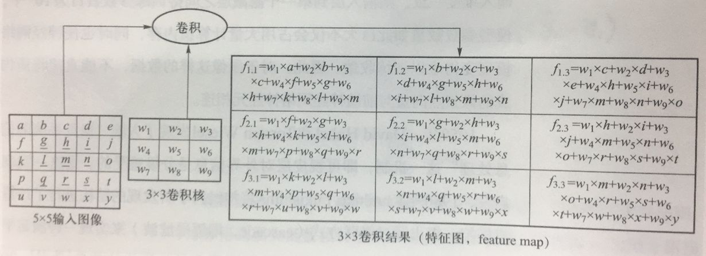
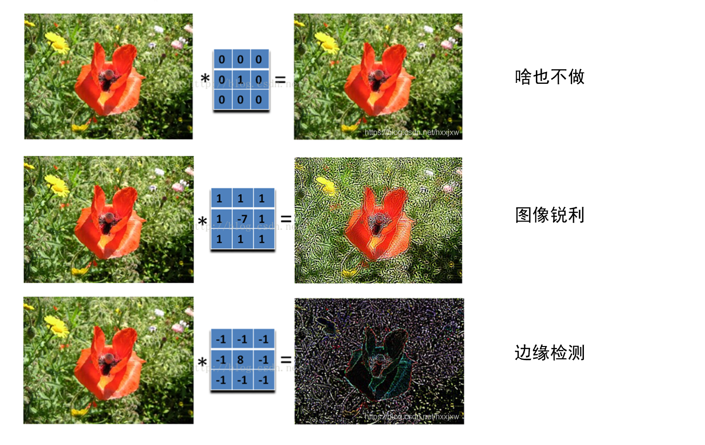
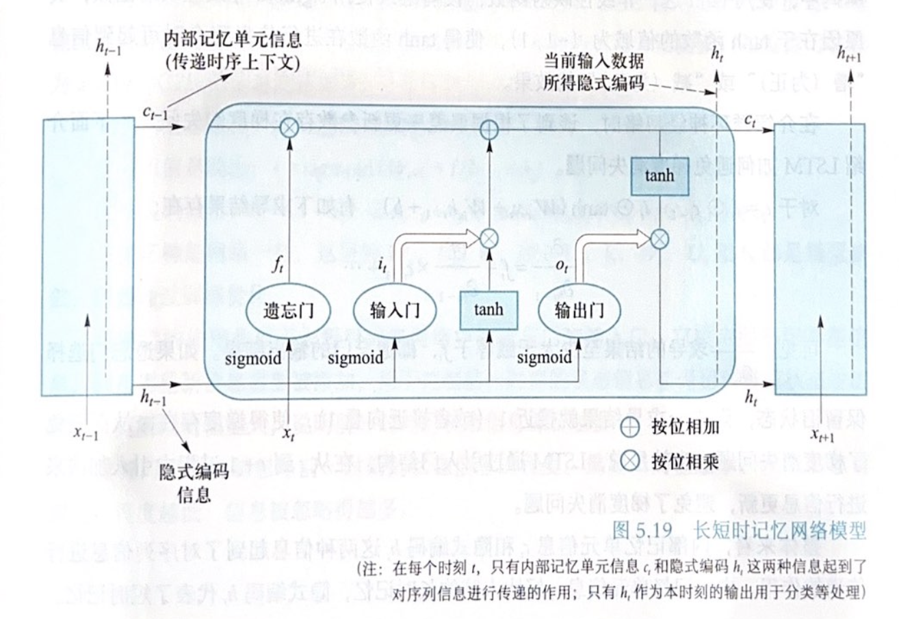
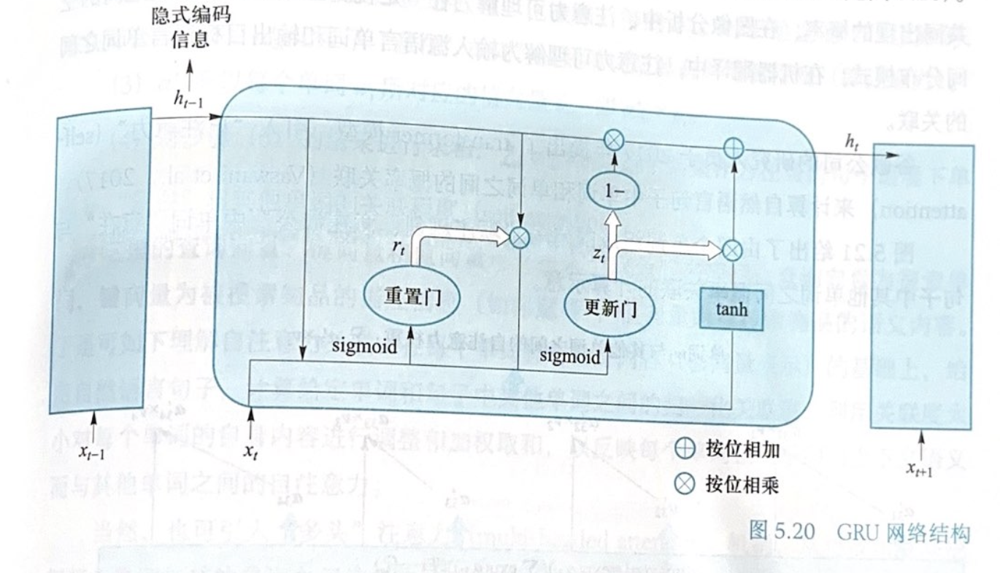

# 深度学习

> 主要使用多层神经网络（如卷积神经网络、循环神经网络）来处理复杂数据。其特点包括：
>
> - **自动特征提取**：无需手动设计特征，能从数据中自动学习。
> - **处理复杂数据**：擅长处理图像、语音、文本等高维数据。
> - **大数据依赖**：通常需要大量数据和计算资源。

## 深度学习的历史发展

1. **1943年：MCP模型**  

      神经科学家 Warren McCulloch 和逻辑学家 Walter Pitts 合作提出了 “McCulloch-Pitts（MCP）neuron” 的思想。MCP 对输入信号线性加权组合，再用符号函数来输出线性加权组合结果，以模拟大脑复杂活动模式。MCP 是最早的神经网络雏形。  

      MCP 中，输入数据只能是 0/1 二值化数据，网络中连接权重和符号函数阈值等都无法从数据中学习。

2. **1949年：赫布理论（Hebbian theory）**  

      提出了神经元之间持续重复经验刺激可导致突触传递效能增加的理论，被总结为经典的描述：“Neurons that fire together, wire together.”  

      赫布理论的强化变化是学习与记忆的生理学基础，这一理论为联结主义人工智能研究提供了认知神经心理学基础。

3. **1958年：方向选择性细胞**  

      David Hubel 和 Torsten Wiesel 在实验中发现，猫后脑皮层中不同视觉神经元与瞳孔所受刺激之间存在某种对应关系，由此发现了一种被称为“方向选择性细胞（orientation selective cell）”的神经元细胞，从而揭示了“视觉系统信号分层处理”这一机制。  

      由于这一贡献，他们共同获得了1981年的诺贝尔生理学或医学奖。

4. **20世纪50年代：感知机模型**  

      神经网络研究的突破来自于 Frank Rosenblatt 提出的“感知机（perceptron）”模型。感知机模型仅包含输入层和输出层，不包含非线性变换操作的隐藏层，因此感知机表达能力较弱（如无法解决异或问题）。

5. **1962年：多层感知机（MLP）**  

      多层感知机的提出，使得神经网络可以包含一个或多个隐藏层，极大地增强了其表达能力。然而，由于没有有效的训练方法，MLP 在当时并未被广泛应用。

6. **1986年：误差反向传播算法（Error Backpropagation）**  

      由 Werbos 提出（1974年），并由 Rumelhart 等人（1986年）完善，使得多层感知机（MLP）的训练变得可行，解决了多层感知机中参数优化这一难题。

7. **2006年：深度置信网络（Deep Belief Network）**  

      Hinton 在《Science》等期刊上发表了论文，首次提出了“深度信念网络（Deep Belief Network）”模型。在相关分类任务上，深度模型的性能超越了传统浅层学习模型（如支持向量机），使得深度架构引起了研究者的广泛关注。

### 

## 前馈神经网络（Feedforward Neural Network, FNN）

### 概述

前馈神经网络（FNN）是人工神经网络的最基本形式，其核心特点是：  

信息从输入层开始，经过隐藏层的逐层传递，最终到达输出层，没有循环或反馈连接。因此，FNN 也被称为无环网络。

前馈神经网络是**监督学习的基础模型**，常用于分类、回归和函数拟合问题。其训练过程主要依赖误差反向传播算法（Backpropagation）来调整网络的权重。

### 神经元的基本结构

神经元是人工神经网络的基本组成单元，其灵感来源于生物神经元的工作原理。每个人工神经元接收来自其他神经元或外部输入的信号，经过加权求和后，应用激活函数得到输出，传递给下一层神经元。

一个神经元的基本计算过程如下：

1. **输入信号**  

      神经元接收来自上一层的输入特征或数据点，记为 $x_1, x_2, ..., x_n$。

2. **加权求和**  

      每个输入信号乘以对应的权重 $w_1, w_2, ..., w_n$，然后加上一个偏置 $b$，形成总的线性组合：
      $$
      z = \sum_{i=1}^n w_i x_i + b
      $$

3. **非线性激活**  

      将线性组合结果 $z$ 输入激活函数 $f(z)$，得到神经元的最终输出：
      $$
      y = f(z)
      $$

      激活函数引入了非线性，使神经元能够模拟复杂的非线性关系，是神经网络的核心组成部分。

### 网络结构

一个典型的前馈神经网络由以下三个部分组成：

1. **输入层**  

      输入层接受来自外部数据的特征向量，通常表示为 $x = [x_1, x_2, ..., x_n]$。  

      输入层的神经元个数等于特征向量的维度。

2. **隐藏层**  

      隐藏层是网络的核心部分，由多个神经元组成，用于提取和组合输入特征。  

      每个隐藏层神经元都通过权重和偏置将输入数据线性组合后，经过激活函数处理，得到非线性输出。  

      一个网络可以有一个或多个隐藏层，隐藏层的数量和每层神经元的数量是网络的超参数。

3. **输出层**  

      输出层根据隐藏层的输出，生成最终的预测结果。  
      
      输出层的神经元个数取决于任务类型：  
      
      - 对于分类任务，输出层神经元的个数等于类别数。  
      - 对于回归任务，输出层神经元的个数等于目标值的维度。

### 数学表示

1. **单个神经元的计算**  

      每个神经元的输出由以下公式决定：
      $$
      z = \sum_{i=1}^n w_i x_i + b
      $$
      其中：  
      $x_i$ 是输入特征，$w_i$ 是权重，$b$ 是偏置，$z$ 是线性组合的结果。

      激活函数对 $z$ 进行非线性变换，得到神经元的输出：
      $$
      y = f(z)
      $$

2. **多层网络的计算**  

      对于整个网络的前向传播，可表示为：
      $$
      a^{(l)} = f(W^{(l)} a^{(l-1)} + b^{(l)})
      $$
      其中：  
      $a^{(l)}$ 表示第 $l$ 层的输出，$W^{(l)}$ 是第 $l$ 层的权重矩阵，$b^{(l)}$ 是第 $l$ 层的偏置向量，$f$ 是激活函数。

3. **输出层**  

      对于输出层，根据任务类型选择合适的激活函数：  

      - 分类任务（多分类）：使用 Softmax 激活函数：
        $$
        y_i = \frac{e^{z_i}}{\sum_{j} e^{z_j}}
        $$
      - 回归任务：输出层通常使用线性激活函数。

### 激活函数

激活函数是前馈神经网络的重要组成部分，用于引入非线性变换，从而使网络能够拟合复杂的非线性关系。常用的激活函数包括：

1. **Sigmoid 函数**  

      $$
      f(z) = \frac{1}{1 + e^{-z}}
      $$
      输出范围为 $(0, 1)$​，适用于概率估计。  

      缺点：梯度消失问题，即激活函数（如 Sigmoid 和 Tanh）在输入较大或较小时会趋于饱和（输出接近于 0 或 1），此时导数的值接近于零。

2. **ReLU（Rectified Linear Unit）函数**  

      $$
      f(z) = \max(0, z)
      $$
      计算简单，收敛速度快。  

      缺点：可能出现“死亡神经元”问题。

3. **Tanh 函数**  

      $$
      f(z) = \frac{e^z - e^{-z}}{e^z + e^{-z}}
      $$
      输出范围为 $(-1, 1)$。

### 损失函数

损失函数（Loss Function）是前馈神经网络训练的核心部分，用于衡量网络的预测结果与实际目标之间的差异。通过最小化损失函数的值，网络能够不断优化其参数，提升模型的性能。

常见的损失函数根据任务类型的不同，可以分为以下几类：

1. **回归任务的损失函数**  

      用于衡量连续值预测任务中预测值与实际值的差异：

      - **均方误差（Mean Squared Error, MSE）**：
        $$
        L = \frac{1}{n} \sum_{i=1}^n (\hat{y}_i - y_i)^2
        $$
        其中，$\hat{y}_i$ 是预测值，$y_i$ 是真实值，$n$​ 是样本数量。  
        
        MSE 具有平滑的梯度，广泛用于回归问题。
        
      - **平均绝对误差（Mean Absolute Error, MAE）**：
        $$
        L = \frac{1}{n} \sum_{i=1}^n |\hat{y}_i - y_i|
        $$
        MAE 对离群值不敏感，但梯度不可导点可能会影响优化过程。

2. **分类任务的损失函数**  

      用于衡量分类任务中预测类别分布与真实类别分布的差异：

      - **交叉熵损失（Cross-Entropy Loss）**：
        $$
        L = -\frac{1}{n} \sum_{i=1}^n \sum_{j=1}^C y_{ij} \log(\hat{y}_{ij})
        $$
        其中，$C$ 是类别数量，$y_{ij}$ 是第 $i$ 个样本的真实分布，$\hat{y}_{ij}$​ 是预测的类别概率。  
        
        交叉熵损失适用于多分类任务，能够很好地处理概率输出。
        
      - **二元交叉熵（Binary Cross-Entropy, BCE）**：
        $$
        L = -\frac{1}{n} \sum_{i=1}^n \left[ y_i \log(\hat{y}_i) + (1 - y_i) \log(1 - \hat{y}_i) \right]
        $$
        BCE 是交叉熵的简化形式，主要用于二分类任务。

3. **正则化项**  

      损失函数中经常引入正则化项，用于防止模型过拟合：

      - **L2 正则化（Ridge Regression）**：
        $$
        L_{\text{reg}} = \lambda \sum_{j=1}^d w_j^2
        $$
        其中，$\lambda$ 是正则化系数，$w_j$ 是权重。

      - **L1 正则化（Lasso Regression）**：
        $$
        L_{\text{reg}} = \lambda \sum_{j=1}^d |w_j|
        $$
        L1 正则化能够产生稀疏的权重矩阵，便于特征选择。

### 感知机模型

感知机模型（Perceptron）是最早的神经网络模型之一，由 Frank Rosenblatt 于 1958 年提出。它是一个线性分类器，通过对输入的线性组合加权，输出一个二值分类结果。

感知机模型的公式为：
$$
y = \text{sign}\left(\sum_{i=1}^n w_i x_i + b\right)
$$
其中，$w_i$ 是权重，$x_i$ 是输入，$b$ 是偏置，$\text{sign}$ 是符号函数。

#### 单层感知机

单层感知机只有一个输入层和一个输出层，适用于线性可分的分类问题。它的主要特点是无法解决异或（XOR）等非线性问题，因此表达能力有限。

#### 多层感知机

多层感知机（MLP）是在单层感知机基础上的扩展，引入了一个或多个隐藏层。隐藏层通过激活函数增加非线性，极大地提升了模型的表达能力，能够解决非线性问题。  

多层感知机的训练通常依赖于误差反向传播算法。

### 参数优化

#### 梯度下降

梯度下降（Gradient Descent）是一种用于优化模型参数的算法，其目标是最小化损失函数值。  

核心思想是：通过计算损失函数关于参数的梯度，沿梯度的负方向更新参数，使损失函数逐步减小。

梯度下降的基本更新规则为：
$$
\theta = \theta - \eta \cdot \nabla_{\theta} L(\theta)
$$
其中：

- $\theta$ 表示模型的参数（如权重 $W$ 和偏置 $b$）。
- $\eta$ 表示学习率，决定每次更新的步长。
- $\nabla_{\theta} L(\theta)$ 表示损失函数 $L(\theta)$ 对参数 $\theta$ 的梯度。

梯度下降通过迭代计算梯度，并对参数进行更新，逐步找到损失函数的极小值点。

#### 误差反向传播

误差反向传播（Backpropagation）是一种高效的梯度计算方法，用于训练神经网络模型。其核心是利用链式法则（Chain Rule），从输出层开始，逐层计算损失函数关于每一层参数的梯度。

1. **前向传播**：  

      输入数据经过网络逐层计算，生成输出值 $\hat{y}$。同时保存每一层的中间结果（如加权和 $z$ 和激活值 $a$​）。

2. **计算损失**：  

      根据预测值 $\hat{y}$ 和目标值 $y$ 计算损失函数 $L(\theta)$​。

3. **反向传播**：  

      - 从输出层开始，计算损失函数对输出层激活值的偏导数。  
      - 利用**求导的链式法则**，逐层将梯度传播到隐藏层和输入层。  
      - 计算每一层参数（如权重 $W$ 和偏置 $b$）的梯度。

4. **参数更新**：  

      将每一层计算出的梯度用于梯度下降，更新参数：
      $$
      W^{(l)} = W^{(l)} - \eta \cdot \frac{\partial L}{\partial W^{(l)}}, \quad b^{(l)} = b^{(l)} - \eta \cdot \frac{\partial L}{\partial b^{(l)}}
      $$

误差反向传播的优点是高效计算复杂网络的梯度，能够支持多层神经网络的训练，是深度学习的关键技术之一。

## 卷积神经网络（Convolutional Neural Network, CNN）

### 概述

卷积神经网络（CNN）是一种特殊的神经网络，专为处理具有网格状拓扑结构的数据（如图像）而设计。它通过引入卷积运算和池化操作，大幅减少模型的参数数量，同时保留重要特征，是深度学习中解决计算机视觉任务的核心模型。

CNN 的关键特性在于其特征提取的局部连接性和权值共享机制，这使得它能够高效捕捉空间和上下文信息。

### 基本组成模块

一个典型的卷积神经网络由以下模块组成：

1. **卷积层（Convolutional Layer）**

      卷积层是 CNN 的核心，用于提取输入数据的特征。它通过卷积核（滤波器）在输入数据上滑动并进行点积运算，从而提取局部特征。

      卷积的计算公式为：
      $$
      y[i, j] = \sum_{m, n} x[i+m, j+n] \cdot w[m, n] + b
      $$
      其中：

      - $x$ 为输入数据。
      - $w$ 为卷积核（权重）。
      - $b$ 为偏置。
      - $y$​ 为卷积结果。

      

      

      卷积的主要特点：

      - **局部连接**：卷积核只作用于局部区域，提取局部特征。
      - **权值共享**：同一卷积核在不同区域滑动，权重相同，大大减少参数量。

      **感受野**：卷积神经网络每一层输出的特征图（feature map）上的像素点在输入图像上映射的区域大小。也就是说，感受野是特征图上一个点对应输入图像上的区域。

2. **激活函数（Activation Function）**

      卷积层的输出通常需要通过非线性激活函数处理，以增强模型的非线性表达能力。常用的激活函数包括：

      - ReLU 函数：
        $$
        f(x) = \max(0, x)
        $$
      - Sigmoid 函数和 Tanh 函数也可以用于 CNN，但 ReLU 更常见。

3. **池化层（Pooling Layer）**

      池化层用于对卷积层的输出进行**降采样，从而减少数据的维度**，保留关键信息并提高计算效率。

      - **最大池化（Max Pooling）**：取池化窗口中的最大值。
      - **平均池化（Average Pooling）**：取池化窗口中的平均值。

      池化操作的公式为：
      $$
      y[i, j] = \text{pool}(x[i:i+k, j:j+k])
      $$
      其中，$\text{pool}$ 表示池化操作（如取最大值或平均值），$k$​ 为池化窗口大小。

      **在常见的几种CNN中，以上三层都是可以堆叠使用的，将前一层的输出作为后一层的输入；也可以自行添加更多的层以实现更为复杂的神经网络。**

4. **全连接层（Fully Connected Layer）**

      全连接层用于**整合卷积层和池化层提取的特征，做一个总结**，并生成最终的分类或回归结果。全连接层（可能有很多层）将高维特征映射到输出空间。

      计算公式为：
      $$
      y = Wx + b
      $$
      其中：

      - $W$ 为权重矩阵。
      - $x$ 为输入特征向量。
      - $b$ 为偏置。
      - $y$ 为输出。

5. **输出层**

      输出层根据任务的具体需求生成预测结果：
      
      - 分类任务：通常使用 Softmax **激活函数生成类别概率**：
        $$
        p(y=c|x) = \frac{e^{z_c}}{\sum_{k=1}^C e^{z_k}}
        $$
        其中，$C$ 为类别数量。
      - 回归任务：输出层通常使用线性激活函数。

**所需学习函数：卷积核、全连接层权重、激活函数参数。**

### 卷积神经网络的结构特点

1. **局部连接性**

      CNN 中的卷积层通过小范围的卷积核捕捉输入数据的局部特征。这种局部连接性使得 CNN 能够很好地适应图像数据的空间结构。

2. **权值共享**

      卷积核的参数在整个输入数据中共享。这不仅减少了参数数量，还增强了模型的泛化能力。

3. **空间不变性**

      由于卷积和池化操作的特性，CNN 对输入的平移、缩放等变换具有一定程度的鲁棒性。

### 神经网络的正则化

正则化（Regularization）是神经网络训练过程中常用的技术，旨在减少模型的过拟合，提升其泛化能力。过拟合通常发生在模型过于复杂（如参数过多）或训练数据不足时，正则化通过限制模型的自由度，防止其过度拟合训练数据。

1. **L1 正则化**

      L1 正则化通过在损失函数中加入权重的绝对值和作为惩罚项，从而鼓励稀疏的权重分布。公式为：
      $$
      L_{\text{reg}} = L + \lambda \sum_{j=1}^d |w_j|
      $$
      其中：

      - $L$ 是原始损失函数。
      - $\lambda$ 是正则化强度的超参数。
      - $w_j$ 是权重。

      优点：L1 正则化能够产生稀疏的权重矩阵，有助于特征选择。

2. **L2 正则化**

      L2 正则化通过在损失函数中加入权重的平方和作为惩罚项，从而防止权重过大。公式为：
      $$
      L_{\text{reg}} = L + \lambda \sum_{j=1}^d w_j^2
      $$
      L2 正则化倾向于缩小权重值，而不是使其变为 0。

      优点：L2 正则化能够有效降低模型复杂度，防止过拟合。

3. **Dropout**

      Dropout 是一种通过随机丢弃一部分神经元（以及其连接）来训练模型的正则化方法。它在每次训练迭代中以一定的概率 $p$ 禁用神经网络中的部分神经元，从而减少节点之间的依赖性，增强模型的鲁棒性。

      - Dropout 的公式为：
        $$
        h_i' = h_i \cdot r_i
        $$
        其中：

        - $h_i$ 是神经元的输出。
        - $r_i$ 是服从伯努利分布的随机变量，取值为 0 或 1。
        - $h_i'$ 是应用 Dropout 后的神经元输出。

      优点：Dropout 简单易用，能够显著减少过拟合。

4. **Batch-Normalization**

      把神经网络每层中任意神经元的输入值分布改变到均值为 0、方差为 1 的标准正态分布。

5. **早停（Early Stopping）**

      早停是一种防止过拟合的正则化方法，其核心思想是在验证集的损失开始上升时提前停止训练。  

      通过观察训练过程中的验证集损失，当验证集损失在多个迭代中不再下降时，停止训练以防止模型对训练数据过拟合。

6. **数据增强**

      数据增强通过对原始训练数据进行变换（如旋转、缩放、翻转、裁剪等），生成新的样本以增加数据量，从而降低过拟合风险。

## 循环神经网络（Recurrent Neural Network, RNN）

### 概述

循环神经网络（RNN）是一种专门用于处理序列数据的神经网络模型。它通过循环结构和隐藏状态的设计，能够捕捉输入数据的时间依赖性和上下文信息，在处理时序数据（如时间序列、文本序列）时表现出色。

循环神经网络的本质是希望**模拟人所具有的记忆能力**，在学习过程中记住部分已经出现的信息，并利用所记住的信息影响后续结点输出。

RNN 的关键特性在于其 **隐藏状态（Hidden State）** 的递归更新，隐藏状态会携带序列的上下文信息并随时间步迭代更新，从而实现对动态序列数据的建模。

擅长领域：

- **自然语言处理**：文本生成、机器翻译、情感分析；
- **语音处理**：语音识别、音乐生成；
- **时间序列分析**：股票预测、天气预报。

### RNN 的基本结构

一个标准 RNN 的结构如下：

1. **输入层**：输入为序列数据 $x = \{x_1, x_2, ..., x_T\}$，其中 $T$ 为序列长度，每个时间步的输入为 $x_t$​。

2. **隐藏层**：隐藏层通过递归公式更新隐藏状态 $h_t$，捕捉时间步之间的依赖关系：
      $$
      h_t = f(W_h h_{t-1} + W_x x_t + b_h)
      $$
      其中：

      - $h_t$ 是当前时间步的隐藏状态。
      - $h_{t-1}$ 是上一时间步的隐藏状态。
      - $x_t$ 是当前时间步的输入。
      - $W_h$ 和 $W_x$ 分别是隐藏状态和输入的权重矩阵。
      - $b_h$ 是偏置。
      - $f$ 是激活函数（如 Tanh 或 ReLU）。

3. **输出层**：输出为每个时间步的**预测值** $\hat{y}_t$：
      $$
      \hat{y}_t = g(W_y h_t + b_y)
      $$
      其中：

      - $g$ 是输出层的激活函数（如 Softmax）。
      - $W_y$ 是隐藏状态到输出的权重矩阵。
      - $b_y$ 是偏置。

### RNN 的特点

1. **时间递归结构**  

      RNN 的隐藏状态通过时间步递归更新，能够捕捉序列的上下文信息。

2. **权值共享**  

      在序列的不同时间步，RNN 使用相同的权重矩阵 $W_h$ 和 $W_x$​，显著减少了模型参数数量。

3. **支持可变长度序列**  

      RNN 能够处理不同长度的输入序列，适用于文本、音频等多种时序数据。

### RNN 的变种

1. **双向循环神经网络（Bidirectional RNN, Bi-RNN）**  

      在标准 RNN 的基础上引入了从序列起点到终点的 **正向传播** 和从终点到起点的 **反向传播**，能够捕捉全局上下文信息。

      - 正向传播：
        $$
        h_t^{\text{(f)}} = f(W_h^{\text{(f)}} h_{t-1}^{\text{(f)}} + W_x^{\text{(f)}} x_t + b_h^{\text{(f)}})
        $$
      - 反向传播：
        $$
        h_t^{\text{(b)}} = f(W_h^{\text{(b)}} h_{t+1}^{\text{(b)}} + W_x^{\text{(b)}} x_t + b_h^{\text{(b)}})
        $$
        最终的隐藏状态为正向和反向隐藏状态的组合：

      $$
      h_t = [h_t^{\text{(f)}}, h_t^{\text{(b)}}]
      $$

2. **长短期记忆网络（LSTM）**  

      LSTM 是一种特殊的 RNN，设计了 **输入门、遗忘门和输出门**，用于控制信息的记忆和遗忘，能够有效缓解标准 RNN 中的梯度消失问题。

      - **输入门**：控制当前输入是否写入单元状态。
      - **遗忘门**：控制前一时间步的信息是否保留。
      - **输出门**：控制当前时间步的单元状态是否输出。

      LSTM 的核心公式包括：

      - 单元状态更新：
        $$
        C_t = f_t \cdot C_{t-1} + i_t \cdot 𝑡𝑎𝑛ℎ(𝑊_{𝑥𝑐} 𝑥_𝑡+𝑊_{ℎ𝑐} ℎ_{𝑡−1}+𝑏_𝑐)
        $$
      - 隐藏状态更新：
        $$
        h_t = o_t \cdot \text{tanh}(C_t)
        $$

      **相当于增加参数，缓解梯度消失的问题。**

      根据公式，可以计算 $c_t$ 关于 $c_{t-1}$ 的偏导数：
      $$
      \frac{\partial c_t}{\partial c_{t-1}} = f_t + \frac{\partial f_t}{\partial c_{t-1}} c_{t-1} + \cdots \geq f_t
      $$

      该推导表明，遗忘门 $f_t$ 的值在梯度传播中起到了关键作用，它可以有效地防止梯度消失 / 梯度爆炸（因为链式法则，求导到前面的时候，梯度会炸）

      

3. **门控循环单元（GRU）**  

      GRU 是 LSTM 的简化版本，结合了遗忘门和输入门，计算效率更高，表现与 LSTM 接近。GRU 的核心公式为：

      - 更新门：
        $$
        z_t = \sigma(W_z x_t + U_z h_{t-1})
        $$
      - 隐藏状态更新：
        $$
        h_t = z_t \cdot h_{t-1} + (1 - z_t) \cdot \tilde{h}_t
        $$

​		其中，$\tilde{h}_t = \text{tanh}(W_h x_t + U_h (r_t \cdot h_{t-1}))$.

## 深度生成学习模型

深度生成学习模型是一类能够从数据中学习分布特性并生成新样本的模型，广泛应用于图像生成、文本生成、数据增强等任务。两种常见的深度生成模型为自编码器（Autoencoder）和生成对抗网络（GAN）。

### 自编码器（Autoencoder）

自编码器是一种**无监督学习模型**，其目标是将输入数据编码到一个低维隐空间（latent space）中，再从隐空间中解码重建原始输入数据（**降维、去噪、数据生成**）。自编码器由两部分组成：

1. **编码器（Encoder）**  

      编码器将输入数据 $x$ 映射到隐空间表示 $z$​：
      $$
      z = f_{\text{encoder}}(x)
      $$
      其中 $f_{\text{encoder}}$ 通常是一个多层神经网络。

2. **解码器（Decoder）**  

      解码器根据隐空间表示 $z$​ 重建输入数据：
      $$
      \hat{x} = f_{\text{decoder}}(z)
      $$
      其中 $f_{\text{decoder}}$ 也是一个多层神经网络。

3. **损失函数**  

      自编码器的损失函数通常是输入 $x$ 和重建数据 $\hat{x}$​ 的差异，例如均方误差（MSE）：
      $$
      L = ||x - \hat{x}||^2
      $$

#### 自编码器的变种

- **变分自编码器（VAE）**：通过引入概率生成模型，对隐变量 $z$ 施加分布约束，从而生成更平滑的样本。
- **稀疏自编码器**：通过添加稀疏性正则化，学习更有效的特征表示。

### 生成对抗网络（Generative Adversarial Network, GAN）

生成对抗网络由 Ian Goodfellow 于 2014 年提出，是一种基于对抗训练的生成模型。GAN 的核心思想是通过两个网络——生成器（Generator）和判别器（Discriminator）之间的博弈，实现高质量数据的生成。

#### 模型结构

1. **生成器（Generator）**  

      生成器的目标是学习数据分布，并根据随机噪声 $z$ 生成接近真实数据分布的样本 $\hat{x}$​：
      $$
      \hat{x} = G(z)
      $$
      其中 $z$ 是从先验分布（如正态分布）中采样的噪声，$G$ 是生成器网络。

2. **判别器（Discriminator）**  

      判别器的目标是区分生成样本 $\hat{x}$ 和真实样本 $x$​：
      $$
      D(x) = p(\text{real}|x)
      $$
      其中 $D$ 是判别器网络，其输出为样本为真实数据的概率。

3. **对抗训练**  

      GAN 的训练过程是生成器和判别器的博弈，损失函数为：
      
      - 判别器的目标是最大化损失函数 $V(D, G)$，使其能正确区分真实样本和生成样本；
      - 生成器的目标是最小化损失函数 $V(D, G)$，使生成的样本能够欺骗判别器。

$$
\min_G \max_D V(D, G) = \mathbb{E}_{x \sim p_{\text{data}}}[\log D(x)] + \mathbb{E}_{z \sim p_z}[\log(1 - D(G(z)))]
$$

#### GAN 的训练过程

1. 随机初始化生成器和判别器的参数。
2. 训练判别器：

    - 从真实数据中采样 $x$，计算 $D(x)$ 的损失。
    - 从先验分布中采样噪声 $z$，生成样本 $\hat{x} = G(z)$，计算 $D(\hat{x})$ 的损失。
    - 更新判别器参数以最大化损失。

3. 训练生成器：

    - 从噪声分布中采样 $z$，生成样本 $\hat{x} = G(z)$。
    - 计算生成样本被判别器误判为真实数据的损失（即最小化 $\log(1 - D(G(z)))$ 或最大化 $\log D(G(z))$）。
    - 更新生成器参数以最小化损失。

4. 重复步骤 2 和 3，直到模型收敛。

## 深度学习中的注意力机制

注意力机制（Attention Mechanism）是深度学习中的一种重要技术，最初被引入到神经机器翻译中，用于动态地选择输入序列中最相关的部分进行处理。其核心思想是通过计算输入特征的加权和来突出关键信息，同时抑制无关信息，从而提高模型的表达能力和性能。

### 注意力机制的背景与意义

1. **问题背景**：  

   在许多任务中（如机器翻译、图像描述生成），输入数据通常是一个变长序列或高维矩阵。传统方法通常压缩输入数据到一个固定大小的向量表示，这容易导致信息丢失和性能下降。

2. **核心思想**：  

   注意力机制通过为输入数据中的每个部分分配一个权重，强调对任务最重要的部分，从而动态地建模全局和局部信息。

3. **应用场景**：  
   - **自然语言处理**：如神经机器翻译、文本摘要、问答系统等。  
   - **计算机视觉**：如图像描述生成、目标检测、图像分类等。  
   - **多模态学习**：如将文本与图像结合生成描述。  

### 注意力机制的计算过程

#### 1. 输入与输出

- 输入：一个变长序列 $X = \{x_1, x_2, ..., x_n\}$，其中 $x_i$ 表示输入的第 $i$ 个特征向量。  
- 输出：一个加权和的上下文向量 $c$，表示输入序列中的重要信息。

#### 2. 计算步骤

1. **注意力权重计算**：  

   对输入序列的每个特征向量 $x_i$，计算其权重 $a_i$，通常采用得分函数 $score(x_i)$：
   $$
   a_i = \text{softmax}(score(x_i)) = \frac{\exp(score(x_i))}{\sum_{j=1}^n \exp(score(x_j))}
   $$
   常用的得分函数包括：
   
   - 点积（Dot Product）：  
     $$
     score(x_i) = x_i^\top q
     $$
     其中 $q$ 是查询向量。  
   - 可学习的线性变换：  
     $$
     score(x_i) = w^\top x_i + b
     $$

2. **权重归一化**：  

   使用 softmax 函数对权重进行归一化，保证权重和为 1。

3. **上下文向量计算**：  

   根据权重对输入序列进行加权求和，得到上下文向量 $c$：  
   $$
   c = \sum_{i=1}^n a_i \cdot x_i
   $$

### 注意力机制的类型

#### 1. **加性注意力（Additive Attention）**

- **提出者**：Bahdanau

## 深度学习的应用

### 自然语言中词向量生成

词向量生成是自然语言处理中深度学习的重要应用之一，其目的是将离散的语言单元（如单词、短语）映射到连续的低维向量空间，捕捉单词的语义和上下文信息。常见的词向量生成方法包括 Word2Vec、GloVe 和基于深度学习的 Transformer 模型。

1. **Word2Vec**  

    Word2Vec 是一种基于浅层神经网络的词向量生成模型，包含两种主要方法： 

    - **CBOW（Continuous Bag of Words）**：根据上下文词预测目标词。  
    - **Skip-Gram**：根据目标词预测上下文词。 

    Word2Vec 的生成目标是通过优化词的共现概率，使相似语义的单词在向量空间中更接近。

2. **GloVe（Global Vectors for Word Representation）**  

    GloVe 是一种全局统计方法，通过最小化单词之间的共现概率差异生成词向量，能够同时捕捉局部和全局的语义关系。

3. **基于深度学习的词向量生成**  

    随着深度学习的发展，基于 Transformer 的预训练语言模型（如 BERT、GPT）已经成为生成词向量的主流方法。  

    - 这些模型利用大规模语料库进行无监督训练，能够捕捉上下文敏感的动态词向量。  
    - 生成的词向量可用于情感分析、问答系统、文本分类等任务。

#### 应用场景
- 情感分析：通过词向量捕捉文本情绪。
- 机器翻译：将源语言的词向量映射到目标语言词向量。
- 信息检索：通过词向量匹配提高查询效率。

### 图像分类和目标定位

图像分类和目标定位是计算机视觉中深度学习的核心应用，涉及图像的语义理解和精确目标识别。常用方法包括基于卷积神经网络（CNN）的模型，如 AlexNet、VGG、ResNet，以及改进的目标检测框架，如 Faster R-CNN 和 YOLO。

1. **图像分类**  

    图像分类任务的目标是根据输入图像的特征，将其归类到预定义的类别中。深度学习通过卷积神经网络（CNN）自动提取图像特征，显著提升了分类精度。  

    - **AlexNet**：首次在 ImageNet 比赛中展现深度学习在图像分类任务上的优势。  
    - **VGG**：通过增加网络深度，实现更精细的特征提取。  
    - **ResNet**：引入残差连接，缓解了深层网络的梯度消失问题。  

2. **目标定位**  

    目标定位的任务是检测图像中目标的具体位置，并给出相应的类别。相比图像分类，目标定位更关注精确的空间信息。  

    - **Faster R-CNN**：通过区域建议网络（RPN）快速生成候选区域，并利用分类器确定目标类别。  
    - **YOLO（You Only Look Once）**：单阶段检测框架，将目标检测任务转换为回归问题，大幅提高检测速度。  
    - **SSD（Single Shot MultiBox Detector）**：结合多尺度特征检测，实现高效的目标定位。  

