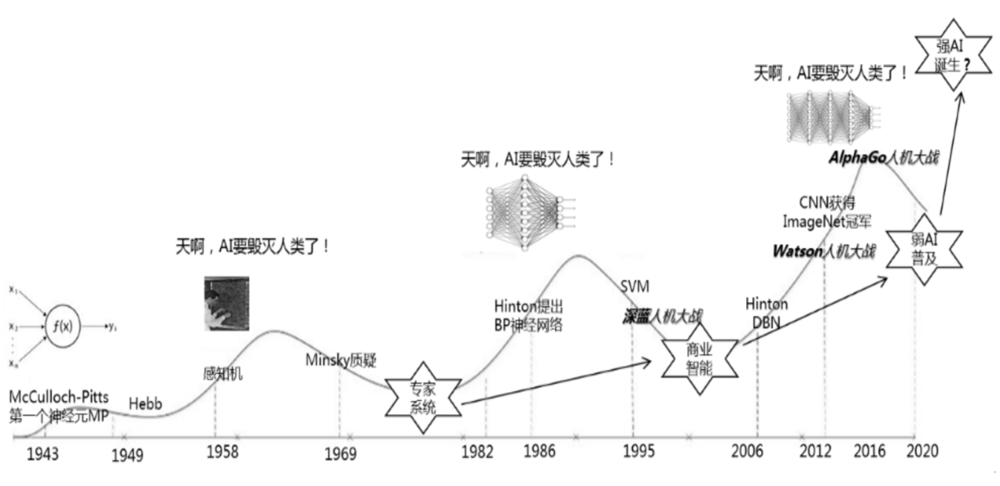

# 深度学习

## 深度学习的历史发展

1. **1943年：MCP模型**  
   神经科学家 Warren McCulloch 和逻辑学家 Walter Pitts 合作提出了 “McCulloch-Pitts（MCP）neuron” 的思想。MCP 对输入信号线性加权组合，再用符号函数来输出线性加权组合结果，以模拟大脑复杂活动模式。MCP 是最早的神经网络雏形。  
   MCP 中，输入数据只能是 0/1 二值化数据，网络中连接权重和符号函数阈值等都无法从数据中学习。

2. **1949年：赫布理论（Hebbian theory）**  
   提出了神经元之间持续重复经验刺激可导致突触传递效能增加的理论，被总结为经典的描述：“Neurons that fire together, wire together.”  
   赫布理论的强化变化是学习与记忆的生理学基础，这一理论为联结主义人工智能研究提供了认知神经心理学基础。

3. **1958年：方向选择性细胞**  
   David Hubel 和 Torsten Wiesel 在实验中发现，猫后脑皮层中不同视觉神经元与瞳孔所受刺激之间存在某种对应关系，由此发现了一种被称为“方向选择性细胞（orientation selective cell）”的神经元细胞，从而揭示了“视觉系统信号分层处理”这一机制。  
   由于这一贡献，他们共同获得了1981年的诺贝尔生理学或医学奖。

4. **20世纪50年代：感知机模型**  
   神经网络研究的突破来自于 Frank Rosenblatt 提出的“感知机（perceptron）”模型。感知机模型仅包含输入层和输出层，不包含非线性变换操作的隐藏层，因此感知机表达能力较弱（如无法解决异或问题）。

5. **1962年：多层感知机（MLP）**  
   多层感知机的提出，使得神经网络可以包含一个或多个隐藏层，极大地增强了其表达能力。然而，由于没有有效的训练方法，MLP 在当时并未被广泛应用。

6. **1986年：误差反向传播算法（Error Backpropagation）**  
   由 Werbos 提出（1974年），并由 Rumelhart 等人（1986年）完善，使得多层感知机（MLP）的训练变得可行，解决了多层感知机中参数优化这一难题。

7. **2006年：深度置信网络（Deep Belief Network）**  
   Hinton 在《Science》等期刊上发表了论文，首次提出了“深度信念网络（Deep Belief Network）”模型。在相关分类任务上，深度模型的性能超越了传统浅层学习模型（如支持向量机），使得深度架构引起了研究者的广泛关注。

### 

## 前馈神经网络（Feedforward Neural Network, FNN）

### 概述

前馈神经网络（FNN）是人工神经网络的最基本形式，其核心特点是：  
信息从输入层开始，经过隐藏层的逐层传递，最终到达输出层，没有循环或反馈连接。因此，FNN 也被称为无环网络。

前馈神经网络是监督学习的基础模型，常用于分类、回归和函数拟合问题。其训练过程主要依赖误差反向传播算法（Backpropagation）来调整网络的权重。

### 神经元的基本结构

神经元是人工神经网络的基本组成单元，其灵感来源于生物神经元的工作原理。每个人工神经元接收来自其他神经元或外部输入的信号，经过加权求和后，应用激活函数得到输出，传递给下一层神经元。

一个神经元的基本计算过程如下：

1. **输入信号**：  
   神经元接收来自上一层的输入特征或数据点，记为 $x_1, x_2, ..., x_n$。

2. **加权求和**：  
   每个输入信号乘以对应的权重 $w_1, w_2, ..., w_n$，然后加上一个偏置 $b$，形成总的线性组合：
   $$
   z = \sum_{i=1}^n w_i x_i + b
   $$

3. **非线性激活**：  
   将线性组合结果 $z$ 输入激活函数 $f(z)$，得到神经元的最终输出：
   $$
   y = f(z)
   $$

激活函数引入了非线性，使神经元能够模拟复杂的非线性关系，是神经网络的核心组成部分。

### 网络结构

一个典型的前馈神经网络由以下三个部分组成：

1. **输入层**：  
   输入层接受来自外部数据的特征向量，通常表示为 $x = [x_1, x_2, ..., x_n]$。  
   输入层的神经元个数等于特征向量的维度。

2. **隐藏层**：  
   隐藏层是网络的核心部分，由多个神经元组成，用于提取和组合输入特征。  
   每个隐藏层神经元都通过权重和偏置将输入数据线性组合后，经过激活函数处理，得到非线性输出。  
   一个网络可以有一个或多个隐藏层，隐藏层的数量和每层神经元的数量是网络的超参数。

3. **输出层**：  
   输出层根据隐藏层的输出，生成最终的预测结果。  
   输出层的神经元个数取决于任务类型：  
   - 对于分类任务，输出层神经元的个数等于类别数。  
   - 对于回归任务，输出层神经元的个数等于目标值的维度。

### 数学表示

1. **单个神经元的计算**：  
   每个神经元的输出由以下公式决定：
   $$
   z = \sum_{i=1}^n w_i x_i + b
   $$
   其中：  
   $x_i$ 是输入特征，$w_i$ 是权重，$b$ 是偏置，$z$ 是线性组合的结果。

   激活函数对 $z$ 进行非线性变换，得到神经元的输出：
   $$
   y = f(z)
   $$

2. **多层网络的计算**：  
   对于整个网络的前向传播，可表示为：
   $$
   a^{(l)} = f(W^{(l)} a^{(l-1)} + b^{(l)})
   $$
   其中：  
   $a^{(l)}$ 表示第 $l$ 层的输出，$W^{(l)}$ 是第 $l$ 层的权重矩阵，$b^{(l)}$ 是第 $l$ 层的偏置向量，$f$ 是激活函数。

3. **输出层**：  
   对于输出层，根据任务类型选择合适的激活函数：  
   - 分类任务（多分类）：使用 Softmax 激活函数：
     $$
     y_i = \frac{e^{z_i}}{\sum_{j} e^{z_j}}
     $$
   - 回归任务：输出层通常使用线性激活函数。

### 激活函数

激活函数是前馈神经网络的重要组成部分，用于引入非线性变换，从而使网络能够拟合复杂的非线性关系。常用的激活函数包括：

1. **Sigmoid 函数**：  
   $$
   f(z) = \frac{1}{1 + e^{-z}}
   $$
   输出范围为 $(0, 1)$，适用于概率估计。  
   缺点：梯度消失问题。

2. **ReLU（Rectified Linear Unit）函数**：  
   $$
   f(z) = \max(0, z)
   $$
   计算简单，收敛速度快。  
   缺点：可能出现“死亡神经元”问题。

3. **Tanh 函数**：  
   $$
   f(z) = \frac{e^z - e^{-z}}{e^z + e^{-z}}
   $$
   输出范围为 $(-1, 1)$。