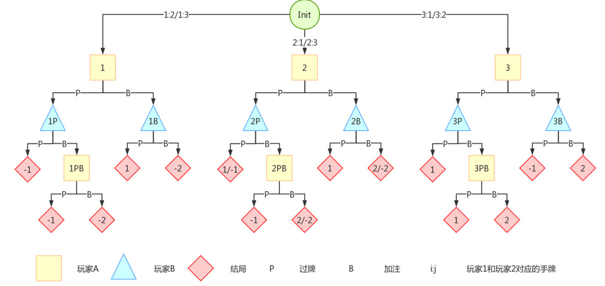

# 人工智能博弈

## 博弈论相关概念

现代博弈论思想起源：冯·诺依曼和奥斯卡·摩根斯特恩《经济论与经济行为》

### 博弈论的基本概念

- **玩家/参与者**：决策主体
- **信息**：玩家获得的与博弈相关的知识
- **规则**：行动的先后顺序，后果等
- **策略**：在采取行动之前就已经准备好的完整行为方案集：所有可能的策略的集合
- **混合策略**：参与者可以按照一定的概率随机选择行为
- **纯策略**：参与者必须按照预先确定的策略来进行决策
- **局势**：参与者采取各自行动之后的状态
- **收益**：得到的回报，利益
- **期望收益**：混合策略下对应的玩家收益

### 博弈的分类

1. **非合作博弈**：指参与者之间没有任何合作关系
2. **合作博弈**：指参与者之间存在合作关系，双方可以互相帮助
3. **静态博弈**：参与者同时决策
4. **动态博弈**：参与者决策有先后顺序，后执行者知道先执行者的行动
5. **完全信息博弈**：所有参与者都知道其他参与者的策略集、收益等信息
6. **不完全信息博弈**：并非所有参与者均掌握所有信息
7. **完美信息博弈**：所有参与者都知道其他人之前采取的行动
8. **零和博弈**：所有参与者收益相加等于零
9. **非零和博弈**：收益和不为0

## 纳什均衡

是指在包含两个或以上参与者的非合作博弈中，假设每个参与者都知道其他参与者的均衡策略的情况下，没有参与者可以通过改变自身策略使自身受益增加的一种概念。

### 例子——监督博弈

- 雇主检查成本为 $C$，给员工支付工资 $W$。
- 员工不偷懒时付出代价 $H$，为公司创造收益 $V$。
- 被发现偷懒需交罚金 $F$。

$$ H < W < V, W > C $$

表格如下：

| 工资 | 不偷懒收益  | 偷懒收益 | 检查成本 |
| ---- | ----------- | -------- | -------- |
| $W$  | $C + F - H$ | $V - C$  | $V - C$  |

由纳什均衡下，任何一方改变行动都不会导致自己更优。

所以确定偷懒的概率，即无论检不检查，雇主的收益都不变，所以偷懒工作的概率为：
$$
\alpha = \frac{H}{W + F}
$$

检查的概率为：
$$
\beta = \frac{C}{W + F}
$$

易得员工期望收益公式为

$$
S_{T_1} = S_{T_2} = V - \frac{CV}{W + F}
$$

当 $W = \sqrt{CV} - F$ 时，收益最大为

$$
S_T^{max} = V - 2\sqrt{CV} + F
$$

### 纳什定理

任何有限策略下的博弈都有一个混合策略纳什均衡。即若参与者采取策略的集合有界，收益函数为实值函数，则博弈对抗必存在混合策略意义下的纳什均衡。

### 策略洛定理

对于任意有限的双人完全信息静态博弈，一定存在先手必胜策略、后手必胜策略或双方平策略。

### 博弈策略求解

对于一个有 N 个玩家参加的博弈，玩家在博弈中采取的策略为 $\sigma_i$。对于所有玩家来说，他们的所有策略构成一个策略组合，记作
$$
\sigma = \{\sigma_1, \sigma_2, \cdots, \sigma_N\}
$$
在策略组合中，除玩家 i 外，其他玩家的策略组合记作
$$
\sigma_{-i} = \{\sigma_1, \sigma_2, \cdots, \sigma_{i-1}, \sigma_{i+1}, \cdots, \sigma_N\}
$$

给定策略组合 $\sigma$，玩家 i 在给定局势下的收益记作 $u_i(o)$。在给定其他玩家的策略组合 $\sigma_{-i}$ 的情况下，对玩家 i 而言的最优反应策略 $\sigma_i^*$ 满足如下条件：

$$
u_i(\sigma_i^*, \sigma_{-i}) \geq \max \{\sigma_i' | \sigma_i' \in \sum \limits_{i} u_i(\sigma_i', \sigma_{-i})\}
$$

其中，$\sum$ 是玩家 i 可选择的所有策略集合。如果条件表示，玩家采取最优反应策略时，玩家能够获得最大收益。

若 $\sigma$ 在什么情况下都是最优解，那么他就是一个纳什均衡策略。

## 遗憾最小化算法

根据以往博弈过程中所有遗憾程度来选择未来行为。

玩家过去在 T 轮中采取策略 $\sigma_i$ 的累加遗憾值定义如下：

$$
Regret_i^{T}(\sigma_i) = \sum \limits_{t=1}^{T}(u_i(\sigma_i, \sigma_{-i}^{(t)}) - u_i(\sigma^{(t)}))
$$

累加遗憾值代表过去 T 轮中，玩家在每一轮中选择策略 $\sigma_i$ 所得到的收益与采取其他策略所得到收益之差的累加。

### 遗憾匹配

根据遗憾值的大小来选择后续第 T+1 轮博弈的策略。

定义有效遗憾值：
$$
Regret_i^{T,+}(\sigma_i) = \max(Regret_i^{T}(\sigma_i), 0)
$$

可得到玩家在轮第 T+1 轮选择策略的概率 $\sigma_i^{(T+1)}$ 为：

$$
\begin{aligned}
P(\sigma_i^{T+1}) = 
\begin{cases} 
\frac{Regret_i^{T,+}(\sigma_i)}{\sum_{\sigma_i' \in \Sigma_i} Regret_i^{T,+}(\sigma_i')} & \text{if } \sum_{\sigma_i \in \Sigma_i} Regret_i^{T,+}(\sigma_i) > 0 \\ 
\frac{1}{|\Sigma_i|} & \text{otherwise}
\end{cases}
\end{aligned}
$$

其中，$I$ 是博弈树上的一个节点，$A(I)$ 是该节点的所有子节点，$\alpha$ 是其中一个行动。

### 总结

- 遗憾值越大，策略具有更高的价值，越选择的概率就越大。
- 依照一定的概率选择行动而不是直接选取遗憾值最大的是为了防止对手发现自己所采取的策略。
- 对于多轮决策（累积效用问题）虚拟遗憾最小化算法可以有效求解。
- 集体通过构建博弈树，表示经过多个节点和相机集合，并做出决策，走到下一个节点，直到到达最终状态。
- 这里是开局就直接选定一个策略，这个策略会很大，接下来这个虚拟遗憾最小则是“走一步看一步”，在特定的节点再进行选择。

## 虚拟遗憾最小化算法

### 虚拟效用值的定义

在策略组合 $\sigma$ 下，对玩家 $i$ 而言，从根节点到当前节点的行为序列路径 $h$ 的虚拟效用值定义为：

$$
v_i(\sigma, h) = \sum_{z \in Z} \pi_{-i}^\sigma(h) \cdot \pi^\sigma(h, z) \cdot u_i(z)
$$

其中：

- $\pi_{-i}^\sigma(h)$：表示**不考虑玩家 $i$ 的策略，到达当前节点 $h$ 的概率**，仅考虑其他玩家策略经过路径 $h$ 对应的动作概率。
- $\pi^\sigma(h, z)$：表示**从当前节点 $h$ 走到叶子节点 $z$ 的概率**。
- $u_i(z)$：表示叶子节点 $z$ 的收益。

在公式中，$\pi_{-i}^\sigma(h)$ 表示从根节点出发，**不考虑玩家 $i$ 的策略，仅考虑其他玩家策略**经过路径 $h$ 的概率。换句话说，即使玩家 $i$ 有其他策略，总是要求玩家 $i$ 在每次选择时都选择路径 $h$ 中对应的动作，以保证从根节点出发能到达当前节点 $h$。

因此，路径 $h$ 的虚拟效用值等于以下三项结果的乘积：  

1. **不考虑玩家 $i$ 的策略（仅考虑其他玩家策略）经过路径 $h$ 到达当前节点的概率**；  
2. **从当前节点 $h$ 走到叶子节点的概率（博弈结束）**；  
3. **叶子节点 $z$ 的收益**。

### 虚拟遗憾值的定义

在定义了行为序列路径 $h$ 的虚拟效用值之后，就可以计算**玩家 $i$ 在基于路径 $h$ 到达当前节点采取行动 $a$ 的遗憾值**：

$$
r_i(h, a) = v_i(\sigma_{i \to a}, h) - v_i(\sigma, h)
$$

其中：

- $v_i(\sigma_{i \to a}, h)$：表示玩家 $i$ 假设自己选择行动 $a$ 时的虚拟效用值。
- $v_i(\sigma, h)$：表示玩家 $i$ 按照当前策略 $\sigma$ 的虚拟效用值。

#### 信息集上的遗憾值累加

对能够到达同一个信息集 $I$（即博弈树中同一个中间节点）的所有行为序列的遗憾值进行累加，即可得到信息集 $I$ 的遗憾值：

$$
r_i(I, a) = \sum_{h \in I} r_i(h, a)
$$

#### 累积遗憾值

类似于传统遗憾最小化算法，虚拟遗憾最小化的遗憾值是 $T$ 轮重复博弈后的累加值：

$$
Regret_i^T(I, a) = \sum_{t=1}^{T} r_i^t(I, a)
$$

其中：

- $r_i^t(I, a)$ 表示玩家 $i$ 在第 $t$ 轮中于当前节点 $I$ 选择行动 $a$ 的遗憾值。

### 有效虚拟遗憾值和策略更新

#### 有效虚拟遗憾值

进一步可以定义有效虚拟遗憾值：

$$
Regret_i^{T,+}(I, a) = \max(Regret_i^T(I, a), 0)
$$

#### 遗憾匹配

根据有效虚拟遗憾值进行遗憾匹配，以计算经过 $T$ 轮博弈后，玩家 $i$ 在信息集 $I$ 情况下，于后续第 $T+1$ 轮选择行动 $a$ 的概率：

$$
\sigma_i^{T+1}(I, a) =
\begin{cases} 
\frac{Regret_i^{T,+}(I, a)}{\sum_{a \in A(I)} Regret_i^{T,+}(I, a)} & \text{if } \sum_{a \in A(I)} Regret_i^{T,+}(I, a) > 0 \\ 
\frac{1}{|A(I)|} & \text{otherwise}
\end{cases}
$$

其中：

- $A(I)$ 是信息集 $I$ 中的所有可选行动集合。

### 遗憾最小化算法的步骤

1. 初始化遗憾值和累加策略表为 0。
2. 采用随机选择的方法决定策略。
3. 利用当前策略参与对手进行博弈。
4. 计算每个玩家采取每次行动后的遗憾值。
5. 根据博弈结果计算每个行动的累加遗憾值大小以更新策略。
6. 重复步骤 (3) ~ (5)，不断优化策略。
7. 根据重复博弈累积最终的策略，完成最终的动作选择。

所以说，这里的 $z$，不一定要是全局的 $z$，而是我们每次进行一轮模拟就会来一次更新（如果这个节点下面的 $z$ 还没有被遍历过，那就会赋值上一个初始的 $v_i$）

### 双人库恩扑克牌游戏

**定义**： 

一种简单的有限注扑克牌游戏，由两名玩家进行游戏博弈。游戏中仅提供牌值为 1、2 和 3 的三张纸牌。  

- 每轮中，每位玩家各持一张纸牌。
- 每位玩家根据自己的判断决定是否追加注定金额赌注。
- 弃牌阶段比较未弃牌玩家的底牌大小，底牌值最大的玩家为胜者。

| 玩家A | 玩家B | 玩家A    | 结果            |
| ----- | ----- | -------- | --------------- |
| 过牌  | 过牌  | 游戏结束 | 牌值大的玩家 +1 |
| 加注  | 加注  | 游戏结束 | 牌值大的玩家 +2 |
| 过牌  | 加注  | 过牌     | 玩家 B +1       |
| 过牌  | 加注  | 加注     | 牌值大的玩家 +2 |
| 加注  | 过牌  | 游戏结束 | 玩家 A +1       |

**初始条件**

- 假设初始情况下，两个玩家都以随机选择的策略进行决策，即在任一节点，都以 $50\%$ 的概率分别选择过牌和加注。
- 若第一轮中，玩家 A 的博弈过程为 $1 \to P \to 1PB \to Z_2$，收益为：

$$
u_A(Z_2) = -2
$$

**玩家 A 针对信息集 $\{1PB\}$ 选择“过牌”行动的遗憾值**

**当前策略下的路径概率**

- 在当前策略下，行为序列 $\{P, B\}$ 产生的概率为：

$$
\pi_B(h) = 1 \times 0.5 = 0.5
$$

- 由于在 $\{1PB\}$ 节点选择加注和过牌的概率均为 $50\%$，所以当前策略下从行为序列 $h$ 到达终结状态 $Z_1$ 和 $Z_2$ 的概率分别为：

$$
\pi^\sigma(h, Z_1) = 0.5, \quad \pi^\sigma(h, Z_2) = 0.5
$$

**当前策略的虚拟效用值**

- 已知 $u_A(Z_1) = -1, \, u_A(Z_2) = -2$，可知当前策略的虚拟效用值为：

$$
v_A(\sigma, h) = \pi_B(h) \times \pi^\sigma(h, Z_1) \times u_A(Z_1) + \pi_B(h) \times \pi^\sigma(h, Z_2) \times u_A(Z_2)
$$

代入具体值：

$$
v_A(\sigma, h) = 0.5 \times 0.5 \times (-1) + 0.5 \times 0.5 \times (-2) = -0.75
$$

**使用“过牌”策略的虚拟效用值**

- 若使用过牌策略，即 $\sigma_{1PB \to P}$，此时玩家 B 促使行为序列 $\{P, B\}$ 达成的概率仍然为 $\pi_B(h) = 0.5$，由于最终达到的终结状态只有 $Z_1$，所以：

$$
\pi^\sigma(h, Z_1) = 1
$$

- 则过牌选择的虚拟效用值为：

$$
v_A(\sigma_{1PB \to P}, h) = \pi_B(h) \times \pi^\sigma(h, Z_1) \times u_A(Z_1)
$$

代入具体值：

$$
v_A(\sigma_{1PB \to P}, h) = 0.5 \times 1 \times (-1) = -0.5
$$

**遗憾值计算**

- 在信息集 $\{1PB\}$ 上采取“过牌”的遗憾值为：

$$
r_I(h, P) = v_A(\sigma_{1PB \to P}, h) - v_A(\sigma, h)
$$

代入具体值：

$$
r_I(h, P) = (-0.5) - (-0.75) = 0.25
$$

## 安全子博弈

安全子博弈（Subgame Perfect Equilibrium, SPE）是博弈论中的一种均衡概念，要求博弈的均衡策略不仅仅在整个博弈中是均衡的，还需要在博弈的每一个子博弈中都是均衡的。换句话说，安全子博弈是一种更强的纳什均衡。

## 博弈规则设计

### 双边匹配算法

**定义**

双边匹配算法（Two-Sided Matching Algorithm）是一类解决具有双方参与者的匹配问题的算法。这种问题的核心特点是，每一方都有自己的偏好或选择规则，目标是找到一个稳定的匹配，使得没有任何未匹配的双方会更愿意彼此匹配而脱离当前匹配状态。

**应用场景**

- **婚姻问题**：经典的“稳定婚姻问题”（Stable Marriage Problem）是双边匹配问题的一个例子，男方和女方各自有对对方的偏好。
- **大学招生**：学校有对学生的偏好，学生也有对学校的偏好。
- **工作招聘**：公司对求职者有偏好，同时求职者对公司也有偏好。

**经典算法：Gale-Shapley 算法**

Gale-Shapley 算法是一种解决双边匹配问题的稳定匹配算法，步骤如下：

1. **初始化**：所有匹配双方均为未匹配状态。
2. **提议**：

   - 一方（如男方）向当前未被拒绝的最高优先级对象（如女方）提出匹配请求。
   - 如果被提议方未匹配，则接受该匹配；如果已匹配，则根据优先级决定是否更换匹配。
3. **重复**：

   - 被拒绝的提议方继续向次优对象提议。
   - 直到所有人都匹配完成。

**特点**

- **稳定性**：算法保证匹配是稳定的，即没有任何一对未匹配的双方会更愿意匹配彼此而背离当前匹配。
- **一方最优**：提出方会获得“最优解”，即所有可能的稳定匹配中对其最有利的匹配。

### 单边匹配算法

**定义**

单边匹配算法（One-Sided Matching Algorithm）是指只有单方参与者进行决策和匹配的问题。所有的匹配选择都由一方完成，匹配对象被动接受或通过某种规则分配。单边匹配问题的目标是优化单方的收益或满足公平性需求。

**应用场景**

- **物品分配**：多个参与者根据优先级选择有限的物品（如课程注册、分配宿舍）。
- **任务分配**：任务分配给工人或设备，工人/设备无法对任务选择施加影响。
- **器官移植分配**：患者等待器官移植，分配器官的决策通常由医疗团队或算法制定。

**常见算法**

1. **贪心算法**：

   - 按照单方的优先级顺序依次匹配。
   - 每次匹配选择当前最优解（如最大化收益或最小化损失）。

2. **随机分配**：

   - 对所有匹配对象进行随机化分配，确保公平性。

3. **轮盘赌法（Roulette Wheel Selection）**：

   - 按照概率分布匹配对象，每个对象的概率与其权重（如优先级）相关。

4. **Hungarian算法**（匈牙利算法）：

   - 解决加权二分图最大匹配问题，将任务与资源匹配以优化总收益。

**特点**

- **简单性**：单边匹配问题通常较为简单，因为只有单方有决策权。
- **效率性**：计算复杂度较低，适合处理规模较大的问题。
- **公平性挑战**：由于另一方无权选择，可能导致不公平分配。

### 双边匹配和单边匹配的对比

| **特性**     | **双边匹配算法**                       | **单边匹配算法**               |
| ------------ | -------------------------------------- | ------------------------------ |
| **参与方**   | 双方（两组参与者）                     | 单方（单组参与者）             |
| **偏好**     | 双方均有偏好或选择规则                 | 仅单方有偏好或选择规则         |
| **目标**     | 稳定匹配，确保没有一对参与者更愿意匹配 | 优化单方的收益或满足分配公平性 |
| **复杂度**   | 相对较高                               | 相对较低                       |
| **典型算法** | Gale-Shapley算法                       | 贪心算法、Hungarian算法等      |
| **应用场景** | 婚姻匹配、大学招生、招聘等             | 任务分配、资源分配、物品分配等 |

**总结**

- 双边匹配算法注重匹配的稳定性和双向满意度，适用于双方均有选择偏好的场景。
- 单边匹配算法更简单高效，适合单方决策的分配场景，但可能会牺牲另一方的公平性。