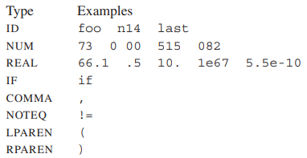
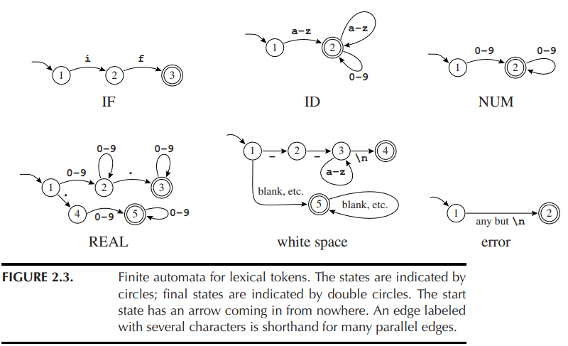
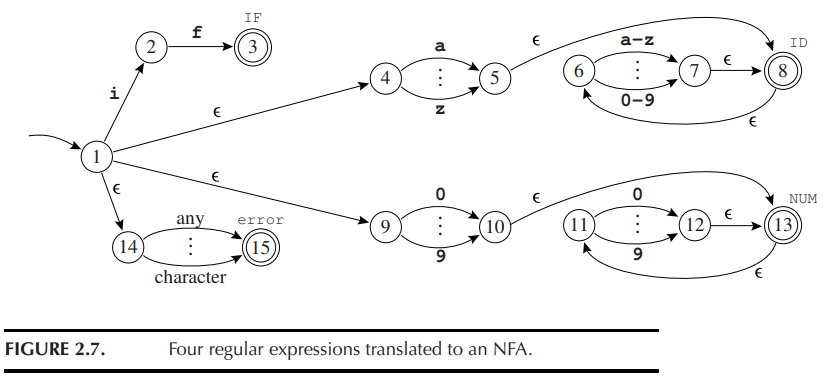
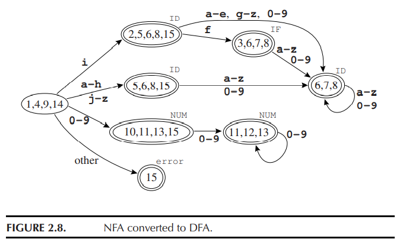

# 词法分析

> 前置知识：正则表达式，DFA / NFA 和二者之间的转换

## Introduction

- **输入：**字符流
- **输出：**抛弃空白符之后，生成的一系列名字、关键字和标点符号


## Lexical Tokens

Tokens 是是指程序设计语言中具有独立含义的最小词法单位，包含单词、标点符号、操作符、分隔符等。

**典型测试语言的 token：**



另外一些 tokens 如 IF, VOID, RETURN 称作 reserved words，在大多数语言中不能成为 identifiers。

**另外一些 nontokens：**


在一些需要宏预处理器的语言中，由预处理器处理源程序的字符流，并生成另外的字符流，然后由词法分析器（Lexical Analyzer）读入新产生的字符流。这种宏预处理过程也可以与词法分析器集成在一起。

```c
float match0(char *s) /* find a zero */
{if (!strncmp(s, "0.0", 3))
    return 0.;
}
```

经过词法分析器产生流：

```c
FLOAT ID(match0) LPAREN CHAR STAR ID(s) RPAREN
LBRACE IF LPAREN BANG ID(strncmp) LPAREN ID(s)
COMMA STRING(0.0) COMMA NUM(3) RPAREN RPAREN
RETURN REAL(0.0) SEMI RBRACE EOF
```

## DFA



将这些进行合并成一个有限自动机：


为了识别最长的匹配，词法分析器应当记录迄今遇到的最长匹配及该匹配的位置，每次到达新的匹配点，就进行更新（因为更长），如果到达了 dead state（即自动机上找不到转移），就会返回最后匹配到的那个状态，然后从那个 last position 继续往后匹配。


有时，词法分析可以分成扫描阶段和词法分析阶段两个部分：

- 扫描阶段主要负责完成一些不需要生成词法单元的简单处理，比如删除注释和将多个连续的空白字符压缩成一个字符；
- 词法分析阶段是较为复杂的部分，它处理扫描阶段的输出并生成词法单元。

## NFA

### 将正则表达式转化成 NFA


将之前的例子转化成 NFA：



### 将 NFA 转换为 DFA

- $edge(s, c)$ 表示从状态 $s$ 沿着字符 $c$ 的一条边到达的所有 NFA 状态的集合

- $closure(S)$ 表示从状态集合 $S$ 中的状态出发，只经过 $\varepsilon$ 迁移到达的状态的集合与 $S$ 的并集，即：
  $$closure(S) = S \cup \left( \bigcup_{s \in S} edge(s, \varepsilon) \right)$$
  称为 $S$ 的 $\varepsilon$ 闭包。我们可以用简单的算法实现 $closure(S)$
  
- $DFAedge(d, c)$ 表示从状态集合 $d$ 中的状态出发，接收符号 $c$ 所达的 NFA 状态的 $\varepsilon$ 闭包，即：
  $$DFAedge(d, c) = closure\left( \bigcup_{s \in d} edge(s, c) \right)$$
  即 $d$ 经 $c$ 可达的所有状态的集合


利用上面的概念，我们可以在 DFA 上模拟词法分析的过程：


就是刚开始找到起始节点的闭包，随后对于闭包内的每个节点进行扩展。

运用类似的想法，可以将 NFA 转化成 DFA：


从起始点的闭包开始，枚举不同的转移，然后把同一个状态的同一个转移移动到同一个节点。



### DFA 的最小化

具体的例子可以看 [xyx 的博客](https://xuan-insr.github.io/compile_principle/1%20Lexical%20Analysis/#25-%E4%BE%8B%E5%AD%90%E4%BB%8E%E6%AD%A3%E5%88%99%E8%A1%A8%E8%BE%BE%E5%BC%8F%E5%88%B0-dfa).

## Lex：词法分析器的生成器

Lex 由词法规范生成一个 C 程序，即一个词法分析器。