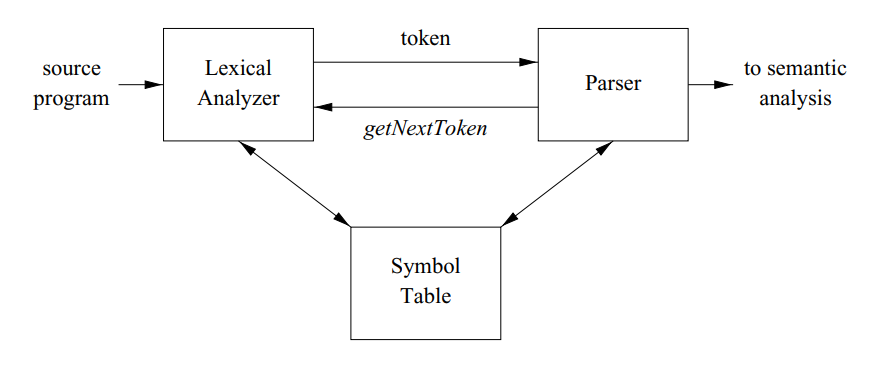

# 词法分析

> 前置知识：正则表达式，DFA / NFA 和二者之间的转换

## Introduction

- **输入：**字符流
- **输出：**抛弃空白符之后，生成的一系列名字、关键字和标点符号



## Lexical Tokens

Tokens 是是指程序设计语言中具有独立含义的最小词法单位，包含单词、标点符号、操作符、分隔符等。

**典型测试语言的 token：**


另外一些 tokens 如 IF, VOID, RETURN 称作 reserved words，在大多数语言中不能成为 identifiers。

**另外一些 nontokens：**


在一些需要宏预处理器的语言中，由预处理器处理源程序的字符流，并生成另外的字符流，然后由词法分析器（Lexical Analyzer）读入新产生的字符流。这种宏预处理过程也可以与词法分析器集成在一起。

```c
float match0(char *s) /* find a zero */
{if (!strncmp(s, "0.0", 3))
    return 0.;
}
```

经过词法分析器产生流：

```c
FLOAT ID(match0) LPAREN CHAR STAR ID(s) RPAREN
LBRACE IF LPAREN BANG ID(strncmp) LPAREN ID(s)
COMMA STRING(0.0) COMMA NUM(3) RPAREN RPAREN
RETURN REAL(0.0) SEMI RBRACE EOF
```

