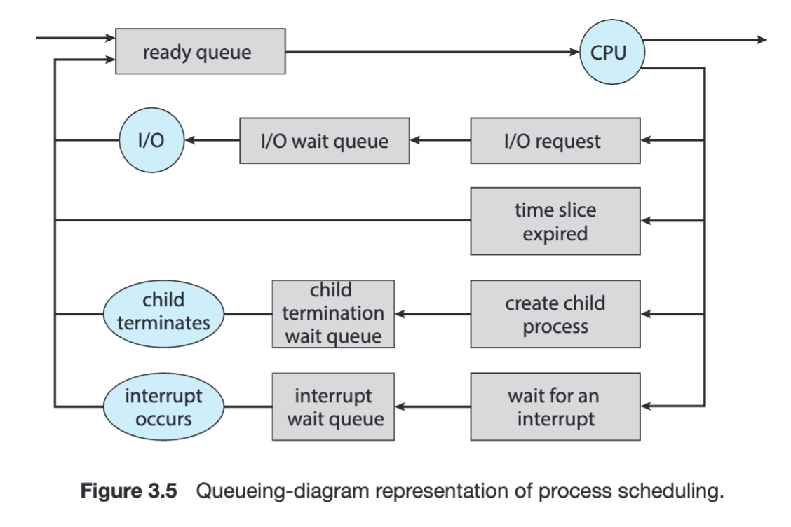
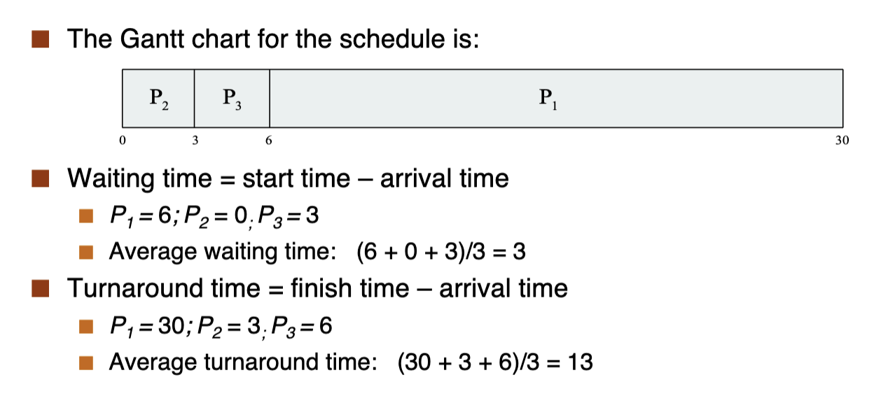
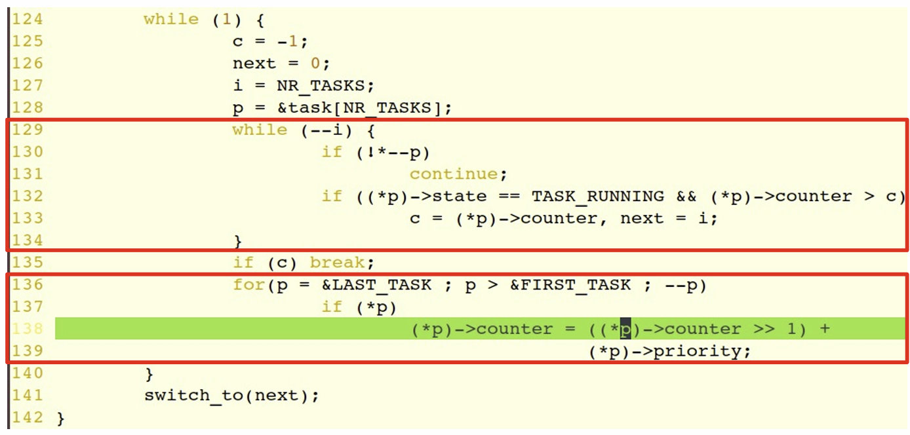
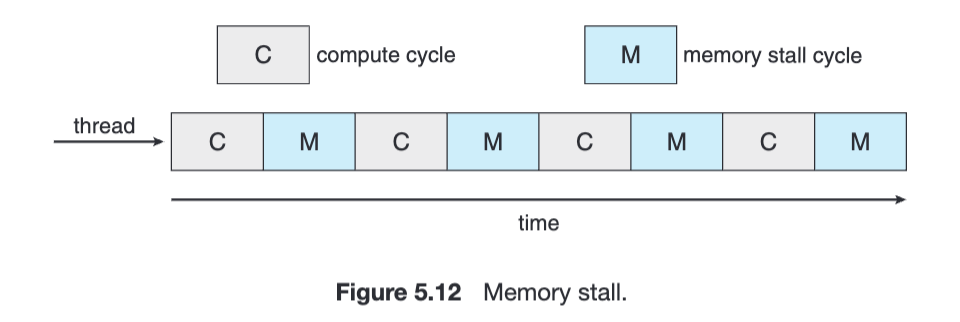

# Scheduling

## 基本概念

大多数进程可以被分为两类：

- I/O Bound Process：花费在 I/O 上的时间多于花费在计算上的时间，只会有很少的 CPU 突发；
- CPU Bound Process：花费在计算上的时间多于花费在 I/O 上的时间，如果存在 I/O 突发，那么会很短，大多很少生成 I/O 突发。

CPU 调度需要维护进程的调度队列，进程会在不同的队列之间移动：

- 就绪队列/Ready Queue：包含所有驻留在主存中，处于就绪状态准备运行的进程；
- 等待队列/Waiting Queues：存放等待着某个事件发生的进程；
- Device Queues：存放等待某个 I/O 设备的进程。
- ...

就绪队列只有一个，但是等待队列一般有多个，因为等待队列等待的事件有很多种，比如等待 I/O 完成、等待子进程终止，等待中断等等：

- 发出 I/O 请求的进程就会放在 I/O 等待队列中；
- 进程可能创建一个新的子进程，这时候就放在子进程等待队列中，等待子进程终止；
- 进程可能由于中断或者时间片到期，被强制释放 CPU，这时候也被放在等待队列中。

- 调度的时候，会按照一定的策略选择等待队列中的进程执行，也就是 **Scheduling Strategy**；进程切换的时候会保存当前进程的状态，也就是 **Context Switch**。

## 调度策略

### 调度策略的分类

需要进行 CPU 调度的情况可以分为下面四种：

1. 当前进程从运行状态/Running 切换到等待状态/Waiting 时；
2. 当前进程从运行状态/Running 切换到就绪状态/Ready 时；
3. 当前进程从等待状态/Waiting 切换到就绪状态/Ready 时；
4. 当前进程从运行状态/Running 切换到终止状态/Terminated 时。

调度策略可以按照发生调度的时机进行分类：

- 非抢占式调度/Nonpreemptive Scheduling/Cooperative：只有当进程自愿放弃 CPU 的时候，才会发生调度，着眼当前 CPU 正在执行的进程，调度只有可能发生在第一种和第四种情况下，因为只有这时的调度原因是该进程自愿放弃 CPU；
- 抢占式调度/Preemptive Scheduling：进程可以被别的进程抢占执行，尽管别的进程可以继续执行下去，也就是在上面的任何时候都有可能发生调度，若以下面的优先级调度为例，有可能有某个新建的进程优先级很高，就直接把当前 CPU 上的进程抢占下来。

### First-Come, First-Served (FCFS)

按照进程到达的顺序进行调度，是一种非抢占式调度策略。

FCFS 的缺点是平均等待时间往往很长。并且如果进程的 CPU 突发时间变化很大，那么平均等待时间的变化也会很大。另外，**FCFS 是一种非抢占调度**，就很有可能出现一种情况：有一个长时间的 CPU 密集型进程后边跟着很多 I/O 密集型进程，这时很多端的进程都等待着一个长的进程，这种情况被称为**护航效应/Convoy Effect**。

### Shortest-Job-First (SJF)

如果两个进程有相同的 CPU 长度，那么就需要用 FCFS 来决定。因此这个策略有时候也被称为**最短下次 CPU 突发调度/Shortest-Next-CPU-Burst Scheduling**。

SJF 算法有两种形式：抢占的和非抢占的。当一个新进程到达就绪队列但是有一个进程正在执行的时候，这两种策略就产生了差别：

- 若是非抢占的 SJF，尽管可能新进程的 CPU 突发时间比当前进程**剩下**的 CPU 时间短，新进程仍然会等待当前进程执行完毕，并将新进程放在就绪队列的顶部；
- 在上面的情况下，抢占 SJF 调度会停止当前进程，将新进程放在 CPU 上执行。抢占 CPU 调度有时候也被称为**最短剩余时间优先调度/Shortest-Remaining-Time-First Scheduling**。

但是这种算法仅仅是理想的，因为我们无法预测进程的 CPU 突发时间，只能通过历史数据来估计。

### Round-Robin (RR)

**轮转调度/Round-Robin Scheduling** 类似于 FCFS 算法，但是为了避免护航效应，轮转调度增加了抢占以切换进程。基本思想是：我们给每个进程一小段执行的时间单元，这个时间单元被称为**时间片/Time Slice** 或者**时间配额/Time Quantum**，当进程用完了时间片，就被踢下去，等待下一次调度。这时候就绪队列也就成为了一个循环队列。

### Priority Scheduling

最短作业优先调度/SJF 是**优先级调度/Priority Scheduling** 的一个特例。对优先级调度而言，我们将每一个进程分配一个优先级，具有最高优先级的进程优先分配 CPU 执行。优先级可以是内部的和外部的：

- 内部的：比如一些测量数据，SJF 策略以预测的 CPU 突发时间作为优先级；
- 外部的：用户可以指定任务的重要程度。

**教材、PPT 都是使用小数字来表示高优先级的！**

优先级调度可以是**抢占**的和**非抢占**的。当一个进程到达就绪队列的时候，就比较它的优先级和当前正在进行的进程的优先级，如果新到达的进程的优先级高于当前运行的进程的优先级，抢占式调度就会抢占 CPU，非抢占式调度就只会将该进程放在就绪队列的顶部（或者说应该放的位置）。优先级调度很容易实现，只需要将就绪队列实现成优先队列/堆就可以了。

将轮询和优先级调度结合起来，系统执行最高优先级的进程并且使用轮询运行具有相同优先级的进程：

优先级调度的一个问题是**无穷阻塞/Indefinite Blocking**，也被称为**饥饿/Starvation**。有可能一个低优先级进程一直都得不到 CPU，很可能是因为一直都有高优先级的进程在运行。低优先级进程无穷等待的解决方法之一好似老化/Aging，老化逐渐增加在系统中等待很长时间的进程的优先级，这样低优先级进程不久就可以拥有高优先级，进而很快被执行。

### Multi-Level Queue Scheduling

在实际应用中，进程通常被分为不同的组，每个组有一个自己的 ready queue，且每个队列内部有自己独立的调度算法。

### Multi-Level Feedback Queue Scheduling

Multilevel Feedback Queue Scheduling 允许进程在队列之间迁移。这种算法可以有很多种实现，因为队列的数量、每个队列中的调度策略、队列之间的调度算法以及将进程升级到更高优先级/降级到更低优先级的队列的条件都是可变的。一个系统中的最优配置在另一个系统中不一定很好。这种算法也是最为复杂的。

看这样一个例子：有三个队列 0, 1, 2，优先级逐次降低。当进程 ready 时被添加到 Q0 中，Q0 内部采用 RR Scheduling，的每个进程都有 8ms 的时间完成其运行，如果没有完成则被打断并进入 Q1；只有当 Q0 为空时 Q1 才可能被运行。Q1 内部也使用 RR Scheduling，每个进程有 16ms 时间完成其运行，如果没有完成则被打断并进入 Q2；只有当 Q1 也为空时 Q2 才可能被运行。Q2 内部采用 FCFS 算法。

### Examples

- `p->counter` 指的是这个任务要跑的时间片；
- 优先级越大，给他的时间片越大；优先级越小，给他的时间片越小。

## 多处理器调度

### 多处理器调度方法

- **非对称多处理/Asymmetric Multiprocessing**：一个处理器是主服务器，处理所有调度决定、I/O 处理以及其他系统活动，其他的处理器只是执行用户代码；
- **对称多处理/Symmetric Multiprocessing**：每个处理器都是自调度的，通过让每个处理器的调度程序检查就绪队列，并且选择要运行的线程来进行调度。

非对称多处理由于只有一个处理核访问系统数据结构，减少了数据共享，所以很简单；但是有一个缺点：主服务器可能成为降低整体系统性能的瓶颈。支持多处理器的**标准方法**是对称多处理/**SMP**。SMP 提供了两种可能的策略来组织符合调度条件的线程：

- 每个线程都在一个共同的就绪队列中；
- 每个处理器有自己的私有线程队列。

- 如果每个线程都在一个共同的就绪队列中，很可能会在共享就绪队列中出现竞争条件，因此必须确保两个处理器不会选择调度同一个线程，并且线程不会在队列中丢失。我们可以通过上锁来保护就绪队列，但是锁是高度竞争的，因为对队列的每个访问都需要锁定所有权，并且访问共享队列可能会成为性能瓶颈。
- 若是每个处理器都有自己的线程队列，那么就不会有竞争条件，因此这成为 **SMP 的首选方法**。这样的系统实际上很可能会更有效地利用缓存，但是处理器之间的负载均衡可能会变得更加困难。

### 多核处理器

SMP 系统拥有多个物理处理器，因此允许多个线程同时运行。现代做法是将多个处理器核心集成到一个物理芯片上，从而产生多核处理器/Multicore Processor。多核处理器的优点是运行快速，功耗更低。

多核处理器的调度问题更为复杂，，一个原因就是**内存停顿/Memory Stall**。内存停顿的原因多种多样，比如缓存不命中。严重情况下，处理器可能花费高达一半的时间等待内存可用。

为了解决内存停顿，现代设计采用了多线程的处理器核，每个核都会分配到两个或多个**硬件线程**，这样，如果一个线程因为内存停顿等待内存，该核心就可以切换到另一个线程。从操作系统来看，每一个硬件线程作为一个**逻辑**处理器运行软件线程，这种多线程称为**芯片多线程/Chip MultiThreading/CMT**。

Intel 使用术语**超线程/HyperThreading** 来描述将**多个硬件线程分配给单个硬件核心**的技术，这种技术也被称为**同时多线程/Simultaneous Multithreading/SMT**。

但是，硬件核心/物理核的资源必须在其上的所有硬件线程之间共享，因此一个处理核质可以一次执行一个硬件线程，因此多线程、多核处理器需要两个不同级别的调度策略：

- 第一级别的调度策略由操作系统作出，用于选择哪个软件线程在哪个硬件线程/逻辑处理器上运行。
- 第二级别的调度策略指定每个核该如何决定运行哪个硬件线程。

这两个级别的调度并不是相互排斥的，如果操作系统调度程序意识到处理器资源的共享，就可以做出更好的调度决策。比如我们有一个双核四线程的处理器，如果该核心上运行着两个软件线程，这两个软件线程可以在同一个核心的两个硬件线程上运行，也可以在两个核心的两个硬件线程上运行。显然分配到不同核心的硬件线程会更好。