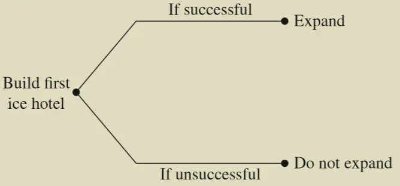
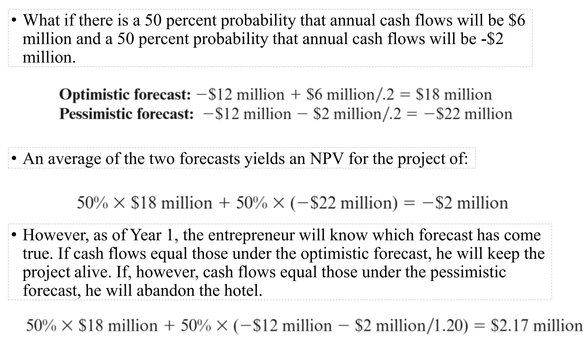

# 现值计算及投资决策

## Discounted Cash Flow Valuation

> 折现现金流估值

- Future Value: 一个物品乘上时间系数的未来价值
- Present Value：现值
- Net Present Value（净现值）= Sale / Rate - Cost
- Compound interest: 复利（利滚利）
- Simple interest: 单利
- Annual Percentage Rate（APR，年化利率），并不是实际利率，因为可以按月结算——Effective Annual Rate(EAR).

### Perpetuity

- 永续年金，从今以后每年都发固定的钱。
- $PV = C/(1+r)+C/(1+r)^2+\cdots=C/r$

### Growing Perpetuity

$PV=C/(1+r)+C(1+g)/(1+r)^2+\cdots=C/(r-g)$

### Annuity

- 年金，有期限
- $PV=C/r[1-1/(1+r)^T]$

**核心：无论怎样交易，都是这个产品在现在的价值是相同的**

- 有些按揭贷款坑的地方：逐月还本金，但是利息固定不变。

### Loan Amortization 

- 分期偿还贷款

#### Pure Discount Loans

简单的一年期贷款，偿还本金+利息

#### Interest-Only Loan

前几年只还利息，最后一年还本金+利息

#### Amortized Loan with **Fixed Principal Payment**

- 每年还的本金是等量的
- 每年要还的利息和剩余的钱有关

#### Amortized Loan with **Fixed Payment**

- 等额本息，每年还的钱是一样的

## Net Present Value and Other Investment Rules

> 净现值和投资评价其他方法.

- 用 NPV（净现值） 来判断是否投资（$NPV=\sum_{t=0}^{n}\frac{CF_t}{(1+R)^t}$）
- 用投资回收期，根据个人风险承受程度来判断
- 折现投资回收期，即考虑利润的回本时间

### The Internal Rate of Return

- The discount that sets NPV to zero.（内部收益率）
- 相当于我投这个项目，我的资金利润是 IRR，和官方利润比较即可
- 当然不能单纯比较 IRR，初始现金也不同
- 同时如果不是常规投资 IRR 可能有很多解
- 修正：先用官方利润，修正至盈利相同。

### Profitability Index

- 盈利指数
- Benefit - Income Ratio

### Payback Criteria

- 投资回收期

### Discounted Payback Criteria

- 折现投资回收期，即考虑利润的回本时间

## Making Capital Investment Decisions

> 投资决策

- 在投资一个新产品的时候，不能仅仅看它的现金流，他的推出可能会影响公司的其他产品，所以应该研究新产品推出以后公司总的现金流变化——Relevant Cash Flows

### Relevant Cash Flows

- Sunk Cost：不管做不做都收不回来的成本（不考虑）
- Opportunity Cost：我如果不做这个项目可以多赚的钱（卖现有设备等等）
- Side Effects: Synergy（协同效应）;     Erosion（侵蚀效应）
- Net Working Capital：净营运资本，在一开始投入运营资本，最后收回，相当于要在最开始投入一笔钱，用于营运，然后原封不动收回，会受到贴现率的影响。
- Finance Cost：一般默认投资的利率就是贴现率，所以不用考虑融资所支付的利息，它和现金的时间效应是一样的，赚的钱转移到 present 减去融资成本就是自己赚的钱。（不考虑）
- Tax Effect：做这个项目要付的税

#### How to Calculate?

- 核心：计算 OCF、NCS、$\Delta NWC$
- EBIT = Sale - Cost - Depr
- OCF = Sale - Cost - Taxes = EBIT +Depr - Taxes = NI + Depr（在没有利息支出的话）
- Taxes = EBIT * T 
- OCF =  (Sales – Costs)(1 – T) + Depreciation * T（可以用公式，也可以列出财务表）
- $CCFA = OCF -NCS - \Delta NWC$（$\Delta NWC$：减少的 NWC）

### Changes in NWC

- Cash in = Sales - ΔAR
- Cash out = COGS - ΔAP（Cost of goods sold）

### Depreciation & Capital Budgeting

- Depreciation tax shield：税盾，因为折旧可以少交的钱（depreciation * marginal tax rate）
- 选择加速折旧（MACRS）还是直线折旧？——看税盾，全部折到同一时间点比较钱。
- “税后残值”：After-Tax Salvage，当我项目结束，折旧完了以后，把固定资产卖掉，如果账面残值和市场价值有差别的话，要多交税。
    - 理解一：多卖钱了，交个人所得税
    - 理解二：你折旧报多了，要把你税盾扣掉

### Investments of Unequal Lives

- 比如我买一个车，有首付、有按揭，并且使用的年限不一样
- 首先算出来买这个车的 NPV，然后把这个折算成“每年应该花多少”（要考虑时间价值！）
- “Equivalent Annual Cost (EAC) ”

## Risk Analysis, Real Options, and Capital Budgeting

### Scenario Analysis

- 情景分析，假定某种情况发生，NPV 会有什么变化
- 一种直观的定性预测方法

### Sensitivity Analysis

- 当一个变量变化时，NPV 所变化的幅度

### Simulation Analysis

- 根据概率分布，来决定做不做
- Monte Carlo Simulation，用统计图来判断

### Break-Even Analysis

- Accounting break-even: sales volume at which NI = 0

    - If a firm just breaks even on an accounting basis, cash flow = depreciation

    - If a firm just breaks even on an accounting basis, NPV will generally be < $0

    - 在这种情况下，OCF = NI + Depr = Depr，相当于上手投入设备钱，然后后来依次赚回折旧，因为贴现所以亏

- Cash break-even: sales volume at which OCF = 0，肯定赔钱，什么钱没拿，设备还变老了

- Financial break-even: sales volume at which NPV = 0，真正刚好不赚不赔

### Real Options

#### The Option to Expand

#### The Option to Abandon

#### The Option to Delay

- 可能过了几年，成本变低，所以会推迟几年再投资

## Interest Rates and Bond Valuation

- **面值 (Par face value)**: 到期时支付给持有人的金额。

- **息票利率 (Coupon rate)**: 发行人按债券的存续期间向债券持有人支付的利率。"息票"一词源于历史上实际使用的息票，用于定期收取利息支付。一旦在发行日设定，债券的息票利率保持不变，债券持有人在预定的时间频率下收到固定的利息支付。

- **利息 (Coupon payment)**

- **到期日 (Maturity Date)**: 债券的最终支付日期，此时本金（及所有剩余利息）到期支付。

- **到期收益率 (The yield to maturity, YTM)**: 债券的市场要求利率；如果投资者持有债券直到到期，投资于债券的内部收益率（IRR），即用户所期望的，到期后能够获得的回报率。

### Bond Concepts

1. 当息票利率 = YTM，价格 = 面值

- **解释**：当债券的息票利率与市场的到期收益率相等时，投资者在市场上可以获得与债券息票支付相同的回报。在这种情况下，债券的价格等于其面值。
- **原因**：因为债券的现金流（息票支付）与市场收益的回报是一致的，因此投资者愿意以面值购买。

2. 当息票利率 > YTM，价格 > 面值（溢价债券）

- **解释**：当债券的息票利率高于市场的到期收益率时，投资者从该债券中获得的现金流（息票支付）超过了他们在其他相同风险水平的投资中能够获得的回报。
- **原因**：这种情况下，投资者愿意支付高于面值的价格，以获得更高的利息支付。因此，这种债券被称为“溢价债券”，因为它的市场价格高于其面值。

3. 当息票利率 < YTM，价格 < 面值（折价债券）

- **解释**：当债券的息票利率低于市场的到期收益率时，投资者从该债券中获得的现金流（息票支付）低于他们在其他相同风险水平的投资中能够获得的回报。
- **原因**：在这种情况下，投资者不愿意支付面值的价格，而是会以低于面值的价格购买债券，以补偿较低的息票支付。因此，这种债券被称为“折价债券”，因为它的市场价格低于其面值。

本质上，还是当前现金流和未来现金流的等价交换。

### Risk

#### Price Risk

- 由于利率变化导致的价格变化
- 长期债券的价格风险高于短期债券
- 低息票利率债券的价格风险高于高息票利率债券（在过程中收获的现金流越多，越早变现风险越小，被市场贴现率影响就越小）

#### Reinvestment Rate Risk

- 再投资，可能之前拿到的现金流再投资就不会有这么高的收益率了
- 高息票利率债券的再投资率风险高于低息票利率债券。

（短期国债一般被认作无风险收益率）

#### Credit Risk

- 债券信用评级：从 3A 到 C/D
- CDS: Credit Default Swap（相当于是保险，而且这个保险，可以你不持有债券，但是买这个风险）

可转债债券：未来无论什么时候都可以以固定的价格把债券转化成股票（当公司出现高成长的时候，债权人可以称为股东来享受公司成长）

（注意，如果公司分红了一块钱，那么转股价格就会下降一块钱；如果多送了一倍的股票，那么转股价格就会砍半；新发了股票，转股价格也会改变）

### The Fisher Effect

- If we require a 10% real return and we expect inflation to be 8%, what is the nominal rate?
- R = (1.1)(1.08) – 1 = .188 = 18.8%

## Stock Valuation

- 估值：就是每年都会分红，如果分红以一定比例增长，那么就是增长性永续年金。

- $PV=C/(1+r)+C(1+g)/(1+r)^2+\cdots=C/(r-g)$（r：希望的年化收益率）

- 如何计算分红的增长率？

    - *g* = Retention ratio（留存收益率） × Return on retained earnings（ROE）

    - | T=0  | TE=1000 | ROE=10% | NI=100 | Div=60   |
        | ---- | ------- | ------- | ------ | -------- |
        | T=1  | TE=1040 | ROE=10% | NI=104 | Div=62.4 |

    - g = 40% * 10% = 4%

- **Growth Opportunities:** P（股票价格） = EPS（Earnings Per Share） / R + NPVGO，即如果分红率是 100，在 NPS / R 的基础上，投资者相信它还有增长的机会（例如未来会执行某个 NPV 大的项目）

    - P/E Ratio = Price pre share / EPS
    - PE = 1 / R + NPVGO / EPS