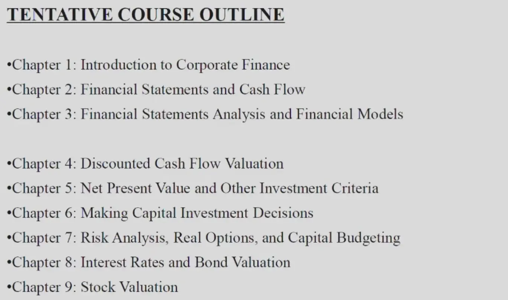
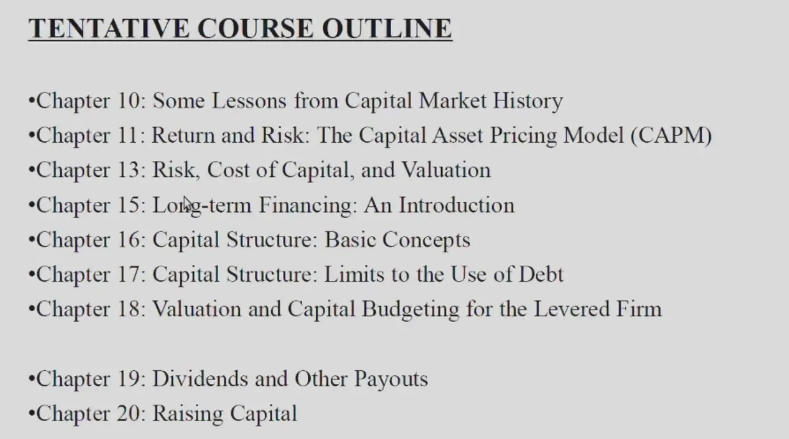
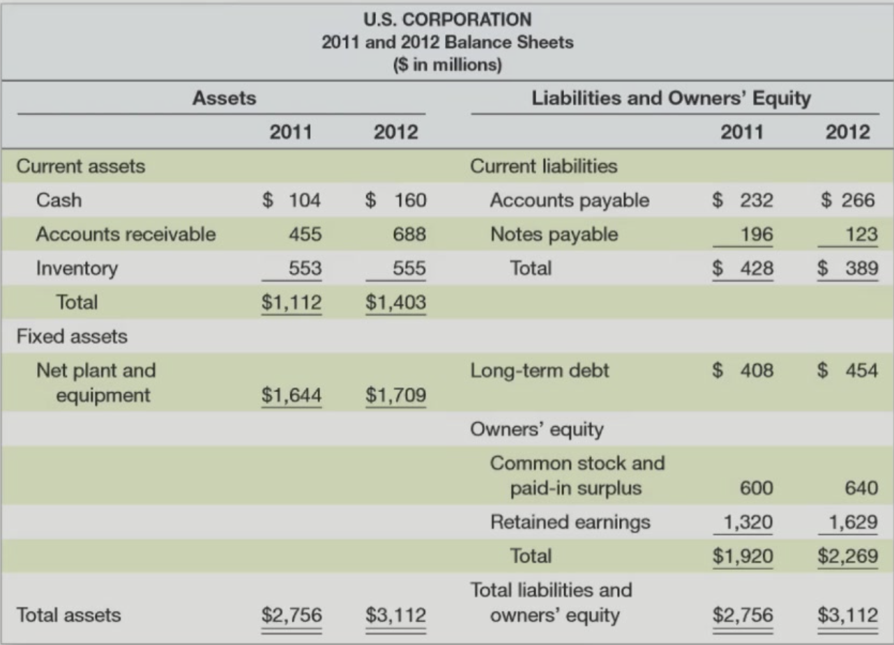
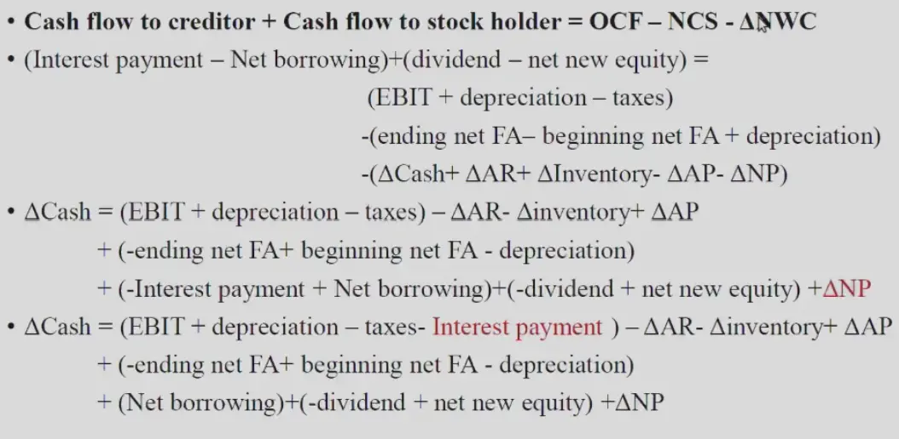
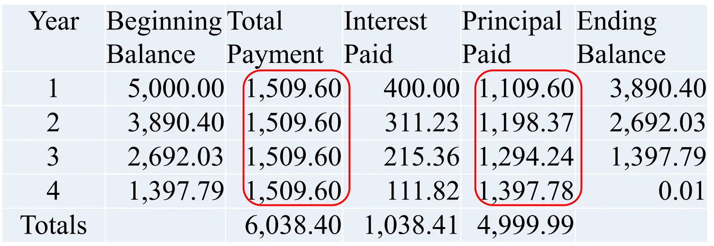
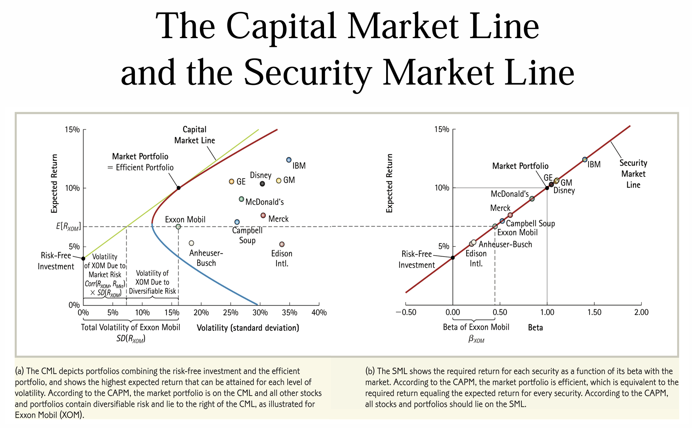
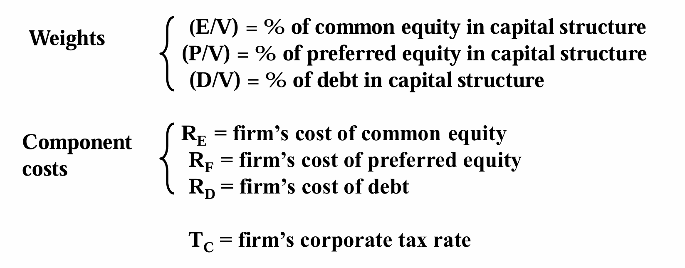
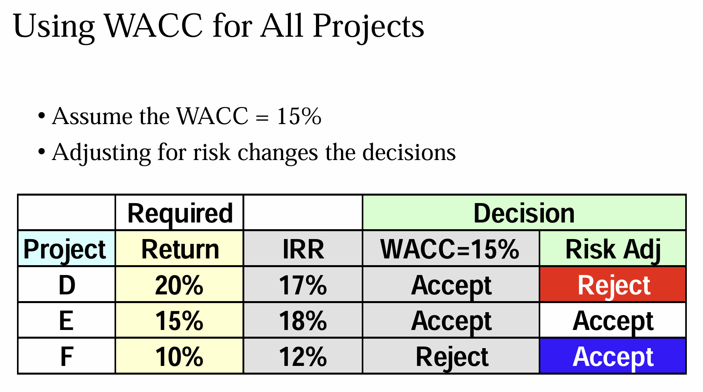
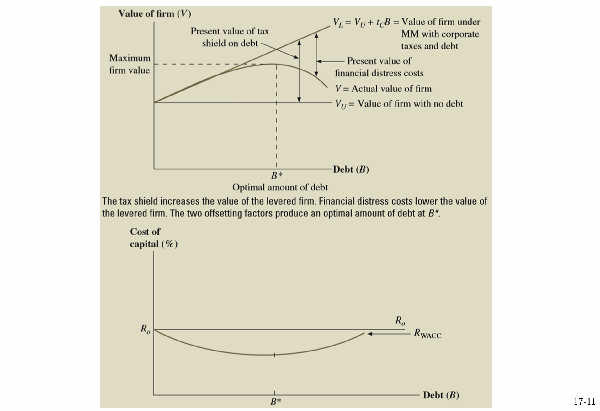

## Chapter 1

### Outline

**“投资、融资、股利政策”**

- 文献综述：10~20 篇，前沿领域、有什么还没做、未来有什么方向；最多 10 页，双倍行距、五号字体，封面、文献列表
- 期末考：20 个选择，5~6 大题，都在讲义里

- Capital Budgeting: 长期投资决策
- Capital Structure: 债务结构选择
- Working Capital Management: 资金流管理（手上现金的管理）

### The Corporate Firm

#### Sole Proprietorship

- 个人独资企业，由一个自然人投资，财产为个人所有
- 个人对企业承担无限责任
- 在交税的时候，可以绕开公司，只交一次税

#### Partnership

- 合伙企业（普通、有限）
- 普通合伙：都是普通合伙，承担无限责任（General Partnership）
- 有限合伙：有普通合伙，有有限合伙；普通合伙管理权更大（Limited Partnership）
- 经济投资人——有限合伙人：只会亏自己投资的钱

新的股份管理方式：同股不同权（？

#### Cooperation

- 有限公司

### Principle Agent Problem

- 代理人问题（代理人和股东目标不一致）
    - 股票激励计划（Equity Incentive Plan）（限制性股票，对售出年限、公司表现都有要求）
    - Active Investor - 先买股票，参与管理，再卖股票
- 提高公司高管的持股比例（看财产年报，但其实不能只看表面，股权可能会有很多层，不想把信息透露在年报？和管理/税收等相关）

融资/投资决策见 PPT

### The Goal of Financial Management

- 最大化股东权益——最大化股票价值
    - 股票价值和股票价格是有差别的，因为股票价格仅有时长供给需求决定
- 降低成本
- 增大市场占有率

### 股票改善公司治理

- 代理人问题
- Poison Pill Plan：防止大股东恶意收购，即用低价把股票卖给所有小股东，使得股票价格下降（市值会提高）；但是大股东买的是市场均价，是低价、原价均衡后的价格，价格比小股东高。（但本质上是恶意提高公司价值）
- Institutional ownership：机构持股，持股多，能力强

### 公司监督

- 独立董事：不持有公司股份、和公司无利益纠葛，监督公司财务情况、保证公司、中小股东利益。

    法律的惩罚和涉案造成的损失不匹配；独立董事薪资和管理金额不匹配；

- 赔偿股东价格：亏损金额*(1-市场风险系数)

- 监事会：检查财务、董事高管个人行为

- 大股东占款：用上市公司的钱，换自己 100% 掌控公司的钱；“其他应收账款”——挪用资金流，导致没有现金流在公司里。

## Chapter 2

> Financial Statements and Cash Flow.

### The Balance Sheet

“资产负债表”——公司的钱全部属于债务 / 股东权益

#### Assets

- Current Assets: Cash, Accounts receivable, Inventory（库存）
- Fixed assets

#### Liabilities and Owners' Equity

- Current liabilities: Accounts payable（应付账款，购买原材料等）, Notes payable（应付票据，直接借钱）
- Long-term debt
- Owners' Equity: Common stock and paid-in surplus（股东给的钱）, Retained earnings（公司为股东赚的钱）

**两部分的钱相等！** 

**流动性**：固定资产能够变现的能力（book value：账上数字；market value：卖掉公司值多少钱）

### The Income Statement

- Revenue - Expenses = Income

- Interest：利润
- Depreciation：折旧，你在第一年买了一个物品，可以把这个成本均摊到各个年份，具体怎么均摊根据政府规定

### Rates

- 对于累进制税率，平均税率和边际税率不一样
- Average：总税率/总收入；Marginal：根据税率表上的等级就是边际税率

### Financial Cash Flow

- 最后剩下来的现金流（Cash Flow From Assets）：还债、给股东利益
- Operating Cash Flow = Earning before interest and taxes + Depreciation - Taxes
- EBIT = Sale - Cost - Dep
- OCF = Sale - Cost - Tax（折旧不会直接影响 OCF，但是会通过影响税来影响 OCF）

###  Net Capital Spending

- The money spent on fixed assets less money received from the sale of fixed assets（在固定资产上多投入了多少钱，卖掉算负投入）
- NCS = Ending net fixed assets - Beginning net fixed assets + Depreciation

### Changes in Net Working Capital

- 投入用于运营的资本，净营运资本
- The net change in current assets.
- 即流动资产的变化，流动的资产是流动的总资产减去流动的债务
- Change in NWC = Ending NWC - Beginning NWC

$CCFA = OCF -NCS - \Delta NWC$​（Cash Flow From Assets）​

- **OCF 是一年所得的现金流，NWC 是一直存在的用于运营的现金，OCF 是从利润表上算出来的（一年度），NWC 是从财务报表上算出来的（总共）。**

**不用管有没有应收款项和应付款项，如果钱没收回来，那么会被算在短期成本变化中被减掉。**

- 得出的 CCFA 就是还债和分红的钱
- Cash flow to creditor = Interest payment - Net borrowing
- Cash flow to stock holder = dividend - net new equity

一些公式和公司现金流的计算（从最基本的公式推导到公司现金流的计算）

## Chapter 3

> Financial Statements Analysis and Long-Term Planning.

### Categories of Financial Ratios

#### Liquidity Ratios

- Current Ratio（流动比率）= CA / CL
- Quick Ratio （速动比率）= (CA - Inventory) / CL
- Cash Ratio （现金比率）= Cash / CL

#### Financial Leverage Ratios

- Total Debt Ratio（负债比率）= (TA - TE) / TA

    （负债率也就是财务杠杆，用更多的钱干更大的事，但是风险更大）

- Debt/Equity （负债权益比） = TD / TE

- Equity Multiplier （权益乘数）= TA / TE = 1 + D/E

#### Asset Management and Turnover Ratios

##### Inventory Ratios

- Inventory Turnover（库存周转率）= COGS / Inventory（每年卖出商品的成本 / 库存记账成本）
- Days' Sales in Inventory（库存周转天数）= 365 / Inventory Turnover 

##### Reveivables Ratios

- Receivables Turnover = **Credit **Sales / Accounts Receivable（越高说明应收账款转化为现金会更快，注意可能有的 sales 可能直接给现金！不算 credit！）
- Days' Sales in Receivables 

##### Asset Turnover Ratios

- Total Asset Turnover = Sales / Total Assets（单位总资产可以产出多少销量）

#### Profitability Measures

- Profit Margin = NI (Net Income) / Sales
- Return on Assets (ROA，资产收益率，对于公司来讲) = NI / TA
- Return on Equity (ROE，权益收益率，对于股东来讲) = NI / TE
- EBITDA Margin（息税、折扣及摊销前利润率） = EBITDA / Sales

#### Market Value Measures

- PPS : Price Per Share
- Shares outstanding : 股票总数
- EPS : Earning Per Share
- PE Ratio（市盈率） = PPS / EPS，市盈率大的公司，说明股市比较看好，未来可以有更大盈利
- Market-to-book ratio = PPS / Book value per share
    - Book value per share = Total Equity
    - 市净率一般会大于 1，市场价值一般会大于账面价值

### The Dupont Identity

### Financial Models

- Dividend payout ratio（股利支付率）= Dividends / NI
- retention ratio（留存收益率）= 1 - d

**当我们想扩大公司规模时（增长公司假设负债表左边所有都等比例增大）：**（例如买入设备会增加 NCS，花的不是 CCFA）

#### External Financing Needed(EFN)

- 分析资产负债表，看看左右差了多少，即为外部融资需求量，表示公司规模增长以后需要的融资
- $EFA=TA\cdot g-sponliab \cdot g-NI(1+g)(1-d)$
- spon liab：负债自然增长率，可视为 0.
- 其实就是在 retained earning 等比例增长以后，先等比例分红，然后投入公司增长，还缺的钱那就是要多借的债务。

#### The Internal Growth Rate

- 内部增长率，在没有外部融资的情况下可能实现最大增长率
- TA * g = NI * (1+g) * b
- g = ROA * b/(1-ROA * b)

#### The Sustainable Growth Rate

- 在没有外部股权融资且负债率不变的情况下最高增长率
- TA * g - NI * (1+g) * b = (TA - TE) * g
- g = ROE * b/(1-ROA * b)

## Chapter 4

> Discounted Cash Flow Valuation: 折现现金流估值

- Future Value: 一个物品乘上时间系数的未来价值
- Present Value：现值
- Net Present Value（净现值）= Sale / Rate - Cost
- Compound interest: 复利（利滚利）
- Simple interest: 单利
- Annual Percentage Rate（APR，年化利率），并不是实际利率，因为可以按月结算——Effective Annual Rate(EAR).

### Perpetuity

- 永续年金，从今以后每年都发固定的钱。
- $PV = C/(1+r)+C/(1+r)^2+\cdots=C/r$

### Growing Perpetuity

$PV=C/(1+r)+C(1+g)/(1+r)^2+\cdots=C/(r-g)$

### Annuity

- 年金，有期限
- $PV=C/r[1-1/(1+r)^T]$

**核心：无论怎样交易，都是这个产品在现在的价值是相同的**

- 有些按揭贷款坑的地方：逐月还本金，但是利息固定不变。

### Loan Amortization 

- 分期偿还贷款

#### Pure Discount Loans

简单的一年期贷款，偿还本金+利息

#### Interest-Only Loan

前几年只还利息，最后一年还本金+利息

#### Amortized Loan with **Fixed Principal Payment**

- 每年还的本金是等量的
- 每年要还的利息和剩余的钱有关

#### Amortized Loan with **Fixed Payment**

- 等额本息，每年还的钱是一样的

## Chapter 5

> Net Present Value and Other Investment Rules，净现值和投资评价其他方法.

- 用 NPV（净现值） 来判断是否投资（$NPV=\sum_{t=0}^{n}\frac{CF_t}{(1+R)^t}$）
- 用投资回收期，根据个人风险承受程度来判断
- 折现投资回收期，即考虑利润的回本时间

### The Internal Rate of Return

- The discount that sets NPV to zero.（内部收益率）
- 相当于我投这个项目，我的资金利润是 IRR，和官方利润比较即可
- 当然不能单纯比较 IRR，初始现金也不同
- 同时如果不是常规投资 IRR 可能有很多解
- 修正：先用官方利润，修正至盈利相同。

### Profitability Index

- 盈利指数
- Benefit - Income Ratio

### Payback Criteria

- 投资回收期

### Discounted Payback Criteria

- 折现投资回收期，即考虑利润的回本时间

## Chapter 6

> Making Capital Investment Decisions. 投资决策

- 在投资一个新产品的时候，不能仅仅看它的现金流，他的推出可能会影响公司的其他产品，所以应该研究新产品推出以后公司总的现金流变化——Relevant Cash Flows

### Relevant Cash Flows

- Sunk Cost：不管做不做都收不回来的成本（不考虑）
- Opportunity Cost：我如果不做这个项目可以多赚的钱（卖现有设备等等）
- Side Effects: Synergy（协同效应）;     Erosion（侵蚀效应）
- Net Working Capital：净营运资本，在一开始投入运营资本，最后收回，相当于要在最开始投入一笔钱，用于营运，然后原封不动收回，会受到贴现率的影响。
- Finance Cost：一般默认投资的利率就是贴现率，所以不用考虑融资所支付的利息，它和现金的时间效应是一样的，赚的钱转移到 present 减去融资成本就是自己赚的钱。（不考虑）
- Tax Effect：做这个项目要付的税

#### How to Calculate?

- 核心：计算 OCF、NCS、$\Delta NWC$
- EBIT = Sale - Cost - Depr
- OCF = Sale - Cost - Taxes = EBIT +Depr - Taxes = NI + Depr（在没有利息支出的话）
- Taxes = EBIT * T 
- OCF =  (Sales – Costs)(1 – T) + Depreciation * T（可以用公式，也可以列出财务表）
- $CCFA = OCF -NCS - \Delta NWC$（$\Delta NWC$：减少的 NWC）

### Changes in NWC

- Cash in = Sales - ΔAR
- Cash out = COGS - ΔAP（Cost of goods sold）

### Depreciation & Capital Budgeting

- Depreciation tax shield：税盾，因为折旧可以少交的钱（depreciation * marginal tax rate）
- 选择加速折旧（MACRS）还是直线折旧？——看税盾，全部折到同一时间点比较钱。
- “税后残值”：After-Tax Salvage，当我项目结束，折旧完了以后，把固定资产卖掉，如果账面残值和市场价值有差别的话，要多交税。
    - 理解一：多卖钱了，交个人所得税
    - 理解二：你折旧报多了，要把你税盾扣掉

### Investments of Unequal Lives

- 比如我买一个车，有首付、有按揭，并且使用的年限不一样
- 首先算出来买这个车的 NPV，然后把这个折算成“每年应该花多少”（要考虑时间价值！）
- “Equivalent Annual Cost (EAC) ”

## Chapter 7

> Risk Analysis, Real Options, and Capital Budgeting

### Scenario Analysis

- 情景分析，假定某种情况发生，NPV 会有什么变化
- 一种直观的定性预测方法

### Sensitivity Analysis

- 当一个变量变化时，NPV 所变化的幅度

### Simulation Analysis

- 根据概率分布，来决定做不做
- Monte Carlo Simulation，用统计图来判断

### Break-Even Analysis

- Accounting break-even: sales volume at which NI = 0

    - If a firm just breaks even on an accounting basis, cash flow = depreciation

    - If a firm just breaks even on an accounting basis, NPV will generally be < $0

    - 在这种情况下，OCF = NI + Depr = Depr，相当于上手投入设备钱，然后后来依次赚回折旧，因为贴现所以亏

- Cash break-even: sales volume at which OCF = 0，肯定赔钱，什么钱没拿，设备还变老了

- Financial break-even: sales volume at which NPV = 0，真正刚好不赚不赔

### Real Options

#### The Option to Expand

#### The Option to Abandon

#### The Option to Delay

- 可能过了几年，成本变低，所以会推迟几年再投资

## Chapter 8

> Interest Rates and Bond Valuation

- **面值 (Par face value)**: 到期时支付给持有人的金额。

- **息票利率 (Coupon rate)**: 发行人按债券的存续期间向债券持有人支付的利率。"息票"一词源于历史上实际使用的息票，用于定期收取利息支付。一旦在发行日设定，债券的息票利率保持不变，债券持有人在预定的时间频率下收到固定的利息支付。

- **利息 (Coupon payment)**

- **到期日 (Maturity Date)**: 债券的最终支付日期，此时本金（及所有剩余利息）到期支付。

- **到期收益率 (The yield to maturity, YTM)**: 债券的市场要求利率；如果投资者持有债券直到到期，投资于债券的内部收益率（IRR），即用户所期望的，到期后能够获得的回报率。

### Bond Concepts

1. 当息票利率 = YTM，价格 = 面值

- **解释**：当债券的息票利率与市场的到期收益率相等时，投资者在市场上可以获得与债券息票支付相同的回报。在这种情况下，债券的价格等于其面值。
- **原因**：因为债券的现金流（息票支付）与市场收益的回报是一致的，因此投资者愿意以面值购买。

2. 当息票利率 > YTM，价格 > 面值（溢价债券）

- **解释**：当债券的息票利率高于市场的到期收益率时，投资者从该债券中获得的现金流（息票支付）超过了他们在其他相同风险水平的投资中能够获得的回报。
- **原因**：这种情况下，投资者愿意支付高于面值的价格，以获得更高的利息支付。因此，这种债券被称为“溢价债券”，因为它的市场价格高于其面值。

3. 当息票利率 < YTM，价格 < 面值（折价债券）

- **解释**：当债券的息票利率低于市场的到期收益率时，投资者从该债券中获得的现金流（息票支付）低于他们在其他相同风险水平的投资中能够获得的回报。
- **原因**：在这种情况下，投资者不愿意支付面值的价格，而是会以低于面值的价格购买债券，以补偿较低的息票支付。因此，这种债券被称为“折价债券”，因为它的市场价格低于其面值。

本质上，还是当前现金流和未来现金流的等价交换。

### Risk

#### Price Risk

- 由于利率变化导致的价格变化
- 长期债券的价格风险高于短期债券
- 低息票利率债券的价格风险高于高息票利率债券（在过程中收获的现金流越多，越早变现风险越小，被市场贴现率影响就越小）

#### Reinvestment Rate Risk

- 再投资，可能之前拿到的现金流再投资就不会有这么高的收益率了
- 高息票利率债券的再投资率风险高于低息票利率债券。

（短期国债一般被认作无风险收益率）

#### Credit Risk

- 债券信用评级：从 3A 到 C/D
- CDS: Credit Default Swap（相当于是保险，而且这个保险，可以你不持有债券，但是买这个风险）

可转债债券：未来无论什么时候都可以以固定的价格把债券转化成股票（当公司出现高成长的时候，债权人可以称为股东来享受公司成长）

（注意，如果公司分红了一块钱，那么转股价格就会下降一块钱；如果多送了一倍的股票，那么转股价格就会砍半；新发了股票，转股价格也会改变）

### The Fisher Effect

- If we require a 10% real return and we expect inflation to be 8%, what is the nominal rate?
- R = (1.1)(1.08) – 1 = .188 = 18.8%

## Chapter 9

> Stock Valuation

- 估值：就是每年都会分红，如果分红以一定比例增长，那么就是增长性永续年金。

- $PV=C/(1+r)+C(1+g)/(1+r)^2+\cdots=C/(r-g)$（r：希望的年化收益率）

- 如何计算分红的增长率？

    - *g* = Retention ratio（留存收益率） × Return on retained earnings（ROE）

    - | T=0  | TE=1000 | ROE=10% | NI=100 | Div=60   |
        | ---- | ------- | ------- | ------ | -------- |
        | T=1  | TE=1040 | ROE=10% | NI=104 | Div=62.4 |

    - g = 40% * 10% = 4%

- **Growth Opportunities:** P（股票价格） = EPS（Earnings Per Share） / R + NPVGO，即如果分红率是 100，在 NPS / R 的基础上，投资者相信它还有增长的机会（例如未来会执行某个 NPV 大的项目）

    - P/E Ratio = Price pre share / EPS
    - PE = 1 / R + NPVGO / EPS

## Chapter 10 / 11

> Risk and Return: Lessons from Market History

- Arithmetic average：简单的每年收益率平均
- Geometric average：最终总收益率然后开次方根

（一个很好的风险对冲的例子，留坑证明：只要不是相关系数为 1，那么就一定可以减小风险）

- Feasible Set：通过投资项目的组合，可以达到的（风险，收益）集合（一般会形成一个向 “收益轴” 凸的曲线）
- Efficient Set：理性投资者会选择的集合（同风险一定会选择收益大的，同收益会选择风险小的）

### Short Sales

> 做空

相当于先借股票，然后在高点抛售，在低点还股票.

如果可以做空，那么可行集的大小会更大（也就是说，我在组合的时候，可以购买负值的股票额）

### Risk-Free Investment

- 引入一个不需要风险的投资（比如短期国债），相当于在 risk = 0 轴上有一个点，这个点可以和风险投资进行组合：

- 比如我选择和风险投资点 P 进行组合，那么组合的点就是一条直线。
- 在 P 点向右，表示贷款投资
- 直线有无数多条，新的可行集是一个扇面——找切线

### Risk Combination

- A systematic risk is any risk that affects a large number of assets, each to a greater or lesser degree. （例如政府政策，加息 / 降息）
- An unsystematic risk is a risk that specifically affects a single asset or small group of assets.（例如单个公司的运营情况）
- 通过资产组合，可以有效降低非系统性风险（系统性风险消不掉，“高系统性风险高回报”）
- 用 $\beta$ 系数衡量系统风险：$\beta = \dfrac{Cov(R_i,R_M)}{Var(R_M)}$​，也就是个股收益率对大盘收益率的敏感性
- 对于大盘来说，它的 $\beta$​ 系数为 1，承担一个单位的系统性风险，大盘的收益率减去无风险收益率就是一个单位风险的风险补偿（风险溢价，因为引入了无风险投资，所以风险 - 收益的有效集是一条直线），**即 CAPM 模型**：

$$
E(r_i)=r_f+\beta_{im}[E(r_m)-r_f]
$$

- 上面这个图，切点就是大盘的收益率和回报率
- 对于各个商品，它和 CML 横向的交点的横坐标就是它的系统风险（收益率不变，通过组合消去非系统性风险）
- 对于一个组合：$\beta_P = \sum_i x_i \beta_i$.

## Chapter 13

> 风险，资本成本和资本预算

- The Market Risk Premium：市场风险溢价，即根据大盘收益率计算出来的这个股票应该有的收益率，低于这个股票实际的收益率，所以很赚
- 估算股票或整个市场的年化预期回报：年化预期回报=股息收益率+股息年增长率
    - 比如我投了 100 块，股息返还了我 2 块，股息增长了 3%
    - 那么就相当于我赚了 2 块以后，我的资产变成了 103 块
    - 这么计算投资者的预期回报率，会有很多问题（比如公司不分红怎么办），所以一般用 $\beta$ 值来计算预期回报率

### Determinants of Beta

#### Business Risk

- Cyclicality of Revenues：一般“周期性”比较强的行业，$\beta$ 值会偏大，因为大盘具有周期性，说明它被大盘的影响较大
- Operating Leverage：经营杠杆，衡量的是固定成本在总成本中所占的比例，并且它描述了销售收入变化对公司盈利的影响（杠杆 = EBIT / sales，对于固定成本高的，我投入了很多，所以后续生产的越多就越省）
- 因此，固定成本越多，约取决于大环境的销量，$\beta$ 值更大

#### Financial Risk

- Financial Leverage：财务杠杆，是指公司通过借入资金（债务）来放大其股东权益回报（即每股收益，EPS）

$$
\beta_{\text{Asset}} = \frac{\text{Debt}}{\text{Debt} + \text{Equity}} \times \beta_{\text{Debt}} + \frac{\text{Equity}}{\text{Debt} + \text{Equity}} \times \beta_{\text{Equity}}
$$

- Debt 的 $\beta$ 值为 0，因为是同一个项目，所以 $\beta_{asset}$ 的值不变，Debt 的比例变高，所以 $\beta_{Equity}$ 不变

**本质上，经营杠杆和财务杠杆是一样的**

### Cost of Debt

- 如果我公司要进行融资，那么融资因为要交利息，所以有成本
- 我所要交的利润，是计算在税前的，所以如果要计算税后的现金流，这个利息是要乘 (1-Tax) 的（相比较下，股东权益是税后的，不用乘系数）

### Cost of Preferred Stock

- 优先股资本成本，相当于分发永续年金
- 相当于投资人买了一个 R = C / PV 回报率的资产
- 相当于公司每年要分发的股东权益为股东的融资乘上 R.

### The Weighted Average Cost of Capital

- **WACC = (E/V) * RE + (P/V) * RF +(D/V) x RD x (1- TC)**

- 公司如何估算单一项目的融资成本：主观估算、找单一出产公司（算 beta）
- 用 WACC 以及风险溢价来做决策（溢价了，就算没到 WACC，也做）

### Flotation Costs 

- 一个项目如果需要融资，发行股票需要成本，发行债券也要成本
- 例如成本是 10%，那么我本来要融 100w，那么我要融 111w

## Chapter 15 

> Long-Term Financing: An Introduction 

- 一个完全没有债务的公司是不可能破产的，因为分红不是它的义务，它可以选择把分红拖几年一起付

没啥好说的，纯介绍性质（例如股权、借款的补偿和提前偿还等；债券融资和股权融资的概念）

## Chapter 16 

> Capital Structure: Basic Concepts

- 想要提高风险和收益：做杠杆
- 想要降低风险和收益：一部分钱存银行进行对冲

### MM Theory

#### No Taxes(I)

- 在没有税收的情况下，一个项目、一个公司的价值不会随着它的资本结构改变而改变
- 公司 A 和公司 B 都在进行相同的投资，**所以它们的现金流 $C$​ 是相同的**。根据现金流现值的计算，公司的总价值应该是一样的（价值一样，风险不一样）；
- 从另一个角度来说，公司的杠杆高，风险高，收益高，但是股东完全可以通过财产组合来降低风险，所以价格是一样的

#### No Taxes(II)

**无税收下的公司A的价值：**

假设公司 A 为纯税务公司，产生一个稳定的现金流 $C$，资本成本为 $r_A$，则公司 A 的价值为：

$$
V_A = \frac{C}{r_A},r_A = \frac{C}{V_A}
$$

**公司B的价值：**

对于公司 B，假设公司 B 的资本结构为：债务总额为 $D$，股东权益为 $E$，其总价值为：

$$
V_B = E + D
$$

假设公司 B 的资本成本由债务成本 $r_D$ 和股本成本 $r_E$ 构成，且公司 B 的资本结构比例为债务 $D$ 和股本 $E$ 的比例。由于没有税收，公司的总资本成本可以写作：

$$
r_B = \frac{D}{V_B} r_D + \frac{E}{V_B} r_E
$$

- 两个公司的价值一样，每年的现金流一样，公司规模不扩张的话必然有 $C = V*r$，所以 $r_A = r_B$.

我们有公式：
$$
R_{WACC} = \dfrac{B}{B+S}R_B + \dfrac{S}{B+S}R_S
$$

通过 LHS 为常数可以得到公式：

- 我们可以发现随着公司增加财务杠杆，股东的风险和权益也会升高.

#### With Taxes

- 如果我借钱的话，即债务比变高，那么我的 EBIT 就会变低，收的税就会变少，导致现金流变多
- 省下来的税的现值：$B*r*T/r=B*T$，因此 $V_L = V_U + T_C B$​
- 可以看作银行提供给你了永续年金，不能用 WACC 除因为 WACC 会变

## Chapter 17

> Capital Structure: Limits to the Use  of Debt 

### Bankruptcy risk versus bankruptcy cost

- 影响公司价值的不是破产风险本身，而是破产情况下需要支付的破产成本
- （因为无论经济形势好不好，资本结构不同的公司，自由现金流都是一样的）
- 比如一个项目，要向股权人融资，然后能赚很多钱；但是如果这个公司是有限责任，而且在破产边缘，那么股东可能不愿意做：因为赚来的钱都用来还债了，最后可能甚至不能回本；那还不如直接破产算了

### Trade-off Theory

- 公司的价值回先增高再降低
- 相对应的，公司的价值越高，说明在相等体量下，它的资本成本更低

### Can Costs of Debt Be Reduced?

- 债务成本降低了，现金流变多，公司价值变大
- 在债务签约的时候加一些保护性条款可以降低债务的收取利润（对于放债人来说，加了保护性条款可以降低破产可能性和破产成本）
- 正向条款：必须做；负向条款：不能做
- **Debt Consolidation**：债务合并，如果一个企业是银团贷款，破产的时候会有谈判成本，把多家债务合并成一家可以减少谈判成本（银团贷款的利息因此可能会比一家银行高）

- 公司价值是所有钱减去 Lawyer 和 Government 拿走的钱，前者拿去“破产成本”，后者拿去“税”；
- 改变资产组合，钱的总额不会变，变的是 L 和 G.

### Signaling

- 为什么公司发债以后公司的股价会涨？——1）说明公司有信心可以还债，未来盈利能力强；2）使用债务融资会使代理人问题降低，因为管理者的股权比例没被稀释（稀释以后管理层可能摆烂了）
- Free Cash Theory：公司有闲钱最好分红还给股东，这样可以有效避免管理层挥霍的代理人问题——负债率上升

（所以要缓解代理人问题，导致的结果很可能是负债率上升）

### The Pecking-Order Theory

- 优序融资理论，应该先融资什么？
- 内部融资——外部债务融资——外部股权融资
- 公司在融资过程中，游说需要成本，信息也会不对称
- 对于内部融资，相当于把本来要分红的钱拿来扩大规模，所以相当于变相地提高了公司总资产
- 根据优势融资理论，负债率会先下降再上升再下降，最重要的是融资成本，第二关心的才是负债率

## Chapter 18

> Valuation and Capital Budgeting for the Levered Firm: 杠杆企业的估值与资本预算

### Adjusted Present Value Approach

- 就是如果项目加杠杆投资的话，会对净现值有什么变化
- APV = NPV + NPVF
- 其中 NPVF 主要是包括税盾和破产成本，破产成本难以估计，所以一般只考虑税盾
- 所以 APV = NPV + T * B

### Flow to Equity Approach

仅从股东的角度来算，股东做这个项目未来可以拿到的现金流总值

- Step One: Calculate the levered cash flows (LCFs) 
- Step Two: Calculate $R_S$​.
- Step Three: Value the levered cash flows at $R_S$. 

本来计算的话，是用总的现金流除以 WACC，现在是用流向股东的现金流除以股东的回报率，本质上这两个算出来的东西是一样的（即向银行借钱这个行为的现金流是 0）。

### WACC Method

就是混在一起计算，用总的现金流除以 WACC

**这三种方法，都是推 mm 理论的过程公式，所以算出来的总价值都是一样的！**

## Chapter 19

>  Dividends and Other Payouts

### Standard Method of Cash Dividend Payment

- Board declares the  dividend and it becomes a liability of the firm：股利宣布日，宣布我要分红的日期
- Date of Record：股权登记日，发给在这天持有股票的人
- Date of Payment：股利支付日，在哪天付钱
- Ex-dividend Date：除夕日，分红股价回跌，具体跌的日期（相当于最早那天买股票，享受不到分红）

### Homemade Dividends

- 投资人可以通过自己卖股票，实现自己想要的分红金额
- 分红以后金额会变低，所以如果分红分少了，多卖一些股票，保证手里股票价值和自己预期的一样即可

### Does Dividend Policy Matter？

- 落袋为安：早分红肯定风险更小
- 代理人问题：分红可以缓解
- 税务相关：分红 / 卖股需要手续、交税，同时也会有税盾等因素
- 信息：公司如果降红利，那么股价大概率会跌

### Clientele Effect

一旦公司确定了自己的股利政策，就不要轻易改变

如果改变，可能会使得原本购买自己股票的投资人不喜欢这样的股利政策，导致股价不稳定

### Repurchase of Stock

本质上还是公司拿现金回流到股东。

- 对于股东来说，有的股东不希望分红，因为要交税（如果回购的话，没有赚钱，就不用交税），可能也想要长期投资
- 对于公司来说，分红是常态化的，股票回购会更加灵活
- 同时，回购股票可以增加股东信息，维护股价
